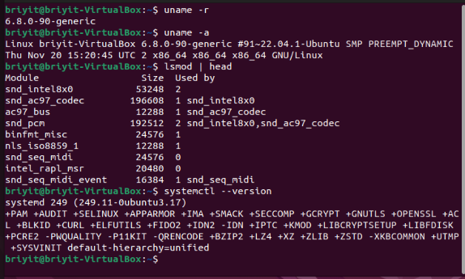

# Tema 1: Fundamentos
**Objetivo:** 
- Entender cómo funciona Linux por dentro.
- Arquitectura del sistema Linux
- Linux **NO** es un sistema operativo completo.
- Linux es solo el kernel.

" El sistema operativo completo se llama GNU/Linux. "
                     
- El kernel hace:
  - Gestiona la memoria
  - Gestiona procesos
  - Gestiona hardware
  - Gestiona permisos
  - Gestiona dispositivos

**Espacio del kernel**
  - Código crítico
  - Control total del hardware
  - No puede fallar
  - No puede ser interrumpido por usuarios
  
**Espacio de usuario**
  - Programas normales
  - Shell
  - Aplicaciones
  - Servicios
  - Comandos
  - Tu terminal, tus scripts, tus programas = espacio de usuario.

**kernel** puede cargar partes adicionales llamadas módulos.
Ejemplos:
  - Controladores de red
  - Controladores USB
  - Sistemas de archivos
Comandos importantes:
  - lsmod → ver módulos cargados
  - modinfo → información de un módulo
  - modprobe → cargar o descargar módulos

## Fases de arranque de Linux y del OS

1. BIOS/UEFI: Despierta el hardware y busca dónde está el sistema.
2. Bootloader (GRUB): Te da a elegir el sistema y carga el Kernel.
3. Kernel: Gestiona la comunicación entre el software y el hardware.
4. init/systemd: El "jefe" de los procesos que arranca todo el software.
5. Servicios: Tareas en segundo plano (internet, audio, impresión).
6. Login: Verifica quién eres mediante usuario y contraseña.
7. Shell: Tu interfaz para escribir comandos y manejar la PC.

- Mini‑ejercicio
  Ejecuta estos comandos en tu terminal:
  - uname -r
  - uname -a
  - lsmod | head
  - systemctl --version

Con eso verificas:
versión del kernel
módulos cargados
versión de systemd

**La BIOS**
Es un programa que se encuentra en la placa base, en un chip físico.
Su trabajo es:
  - Encender el hardware
  - Comprobar que todo funciona
  - Buscar desde dónde arrancar (disco, USB, etc.)
  - Entregar el control al siguiente paso: el bootloader

**El bootloader** 
Es un pequeño programa que se encarga de:
- Mostrar el menú de arranque
- Cargar el kernel de Linux en memoria
- Pasarle parámetros al kernel
- El más común es GRUB.

**El kernel**
- Detecta hardware
- Carga controladores
- Monta el sistema de archivos raíz /
- Inicia el proceso PID 1 (el primer proceso del sistema)
- El kernel NO tiene interfaz gráfica, NO tiene terminal, NO tiene programas.
Es solo el núcleo.

**systemd es**
El primer proceso que arranca (PID 1)
- El que inicia todos los servicios
- El que controla el arranque, apagado, logs, etc.
Ejemplos de servicios que arranca:
  - red
  - login
  - cron
  - ssh
interfaz gráfica (si existe)

**Servicios** “Las piezas que hacen funcionar el sistema”
Ejemplos:
- NetworkManager → red
- sshd → acceso remoto
- cron → tareas programadas
- cups → impresión
Todos ellos son gestionados por systemd.

**Login** “Tu acceso al sistema”
Aquí aparece:
la pantalla de login
o la terminal para escribir usuario y contraseña

**Shell** “Tu herramienta para hablar con Linux”
Cuando te logueas, se abre la shell:
bash
zsh
sh
Y ahí ya puedes ejecutar comandos.

`El shell` es el programa que te permite interactuar con el sistema operativo escribiendo comandos.
Cuando ves la terminal y escribes ls, cd, mkdir, etc.
Estás usando el shell para hablar con Linux.

| Elemento | ¿Qué es? |
|:--|:--|
|Terminal|La ventana o interfaz donde escribes comandos.|
|Shell|El programa que interpreta esos comandos y los ejecuta.|

