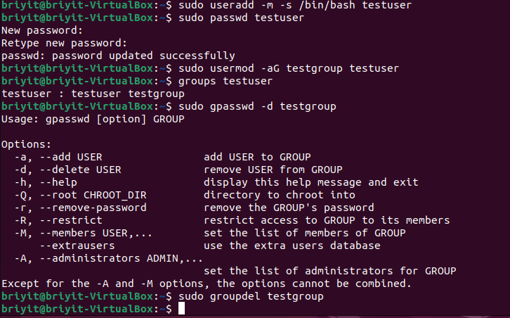
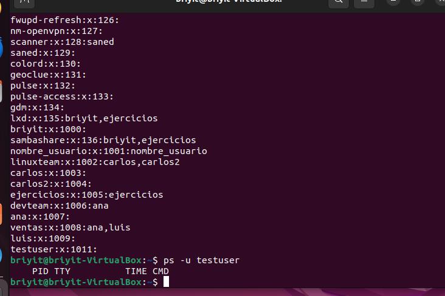
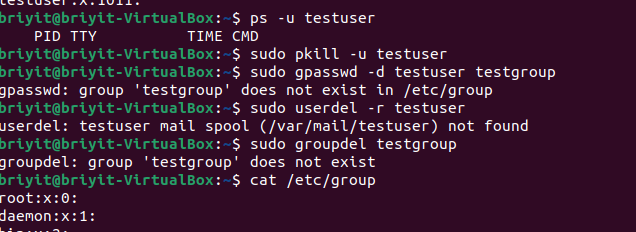
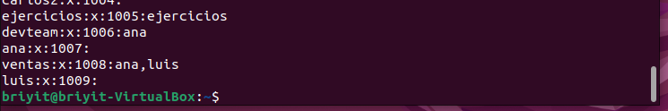
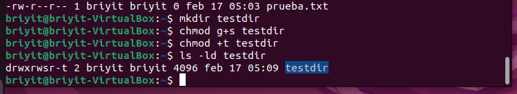

# BLOQUE 2 — TEMA 1: Usuarios, Grupos y Permisos en Linux
Linux es un sistema multiusuario, todo lo que ocurre depende de:
- Quién ejecuta un comando
- Qué permisos tiene
- A qué grupo pertenece
- Qué privilegios puede elevar
---
Este tema cubre desde permisos básicos hasta permisos especiales y ACLs.
---
##  1. Usuarios en Linux
Un usuario es una identidad dentro del sistema.
- Cada usuario tiene:
  - nombre
  - UID (User ID)
  - grupo principal
  - grupos secundarios
  - directorio home
  - shell
  - permisos asociados
---
## 2. Grupos en Linux
Un grupo es un conjunto de usuarios que comparten permisos.Ejemplos típicos:

- Grupo	Función
- sudo	usuarios que pueden usar sudo
- www-data
- usuarios del servidor web
- docker
- usuarios que pueden usar Docker sin sudo
---
- Ejercicio practico: [Usuarios_Grupos]( Usuarios_Grupos_Linux.md)
## 3. Archivos importantes del sistema
- `/etc/passwd `— Información de usuarios

```text

usuario:x:UID:GID:comentario:/home/usuario:/bin/bash

```
- `/etc/shadow `— Contraseñas encriptadas. Solo root puede leerlo.

**Ejemplo:**
```text
briyit:$6$kjsdfh8H...:19876:0:99999:7:::
```
- `/etc/group` — Grupos del sistema

```text
grupo:x:GID:miembros
```

## 4. Tipos de usuarios
- Tipo	UID	Descripción
- root	0	administrador total
- usuarios del sistema	1–999	servicios (www-data, mysql…)
- usuarios normales	1000+	los que tú creas
  
## 5. Tipos de grupos
- Grupo principal → el grupo por defecto del usuario
- Grupos secundarios → permisos adicionales

```text
uid=1001(briyit) gid=1001(briyit) groups=1001(briyit),27(sudo),1002(docker)
```

###  Comandos esenciales

| Comando	| Función |
|id|	ver UID, GID y grupos|
|whoami|	ver usuario actual|
|groups|	ver grupos|
|useradd	|crear usuario|
|usermod	|modificar usuario|
|userdel |	eliminar usuario |
|passwd |	cambiar contraseña |
| groupadd	| crear grupo |
| groupdel |	eliminar grupo |
| gpasswd |	gestionar grupos|

## Gestión de usuarios
- Crear usuario (forma correcta)
```bash
sudo useradd -m -s /bin/bash juan
```
- Asignar contraseña
```bash
sudo passwd juan
```
- Añadir a un grupo
```bash
sudo usermod -aG sudo juan
```
- Eliminar usuario + home
```bash
sudo userdel -r juan
```
### Mini‑laboratorio de grupos
- Crear grupo
- Crear usuario
- Añadir usuario al grupo
- Verificar
- Quitar del grupo
- Eliminar grupo
- Si no se elimina, puede ser porque el usuario tiene procesos activos.
Solución:

```bash
sudo pkill -u testuser
```

 - 
 - 
 - 
 - 

## Permisos en Linux
Cada archivo tiene permisos para:

  - u → usuario
  - g → grupo
  - o → otros

-Permisos:

  - r → leer
  -  w → escribir
  -  x → ejecutar


### Tipos de archivos (primer carácter)
|Símbolo	Tipo
|-	|archivo |
|d	|directorio |
|l	|enlace |
|c	|dispositivo de caracteres |
|b	|dispositivo de bloques |

###  Cambiar permisos — chmod
- **Modo simbólico**
Código
chmod u+x archivo
chmod g-w archivo
chmod a+r archivo
- **Modo numérico**
Permiso	Valor
- r	4
- w	2
- x	1

- Ejercicio administracion del sistema: [Administracion_usuarios_grupo](administracion_basica_usuarios.md)

###  Cambiar propietario — chown
- `sudo chown usuario archivo`
- `sudo chown usuario:grupo archivo`
  
## Permisos especiales

1. SUID `(u+s)` :Ejecuta el archivo con permisos del propietario.
- `chmod u+s archivo`

2. SGID `(g+s)` :En directorios: los archivos heredan el grupo.
- Muy usado en proyectos compartidos.
- `chmod g+s carpeta`
  
3. Sticky Bit `(t)` : Evita que un usuario borre archivos de otros.
-` chmod +t carpeta`

### Mini‑laboratorio de permisos especiales
- Crear carpeta
- Activar SGID
- Activar Sticky Bit
- Ver permisos
- Resultado esperado: drwxr-sr-t

 - 
##  ACLs — Permisos avanzados

