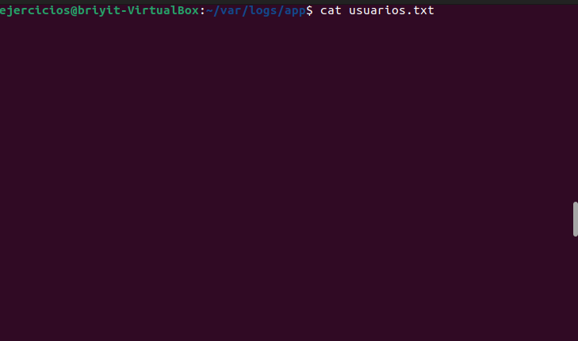
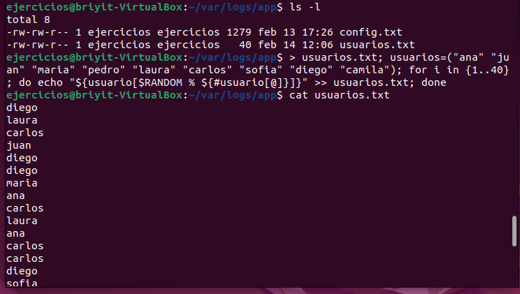
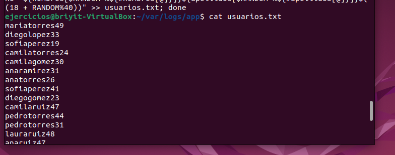
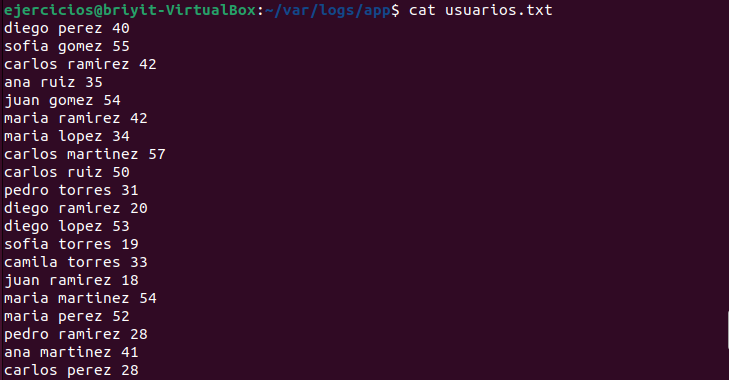
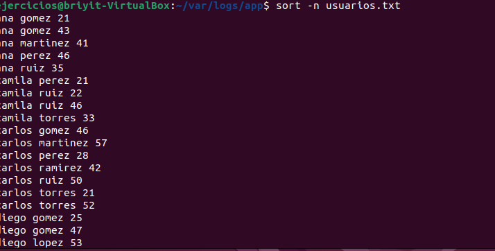
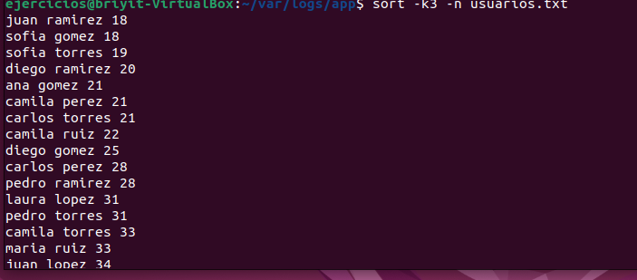
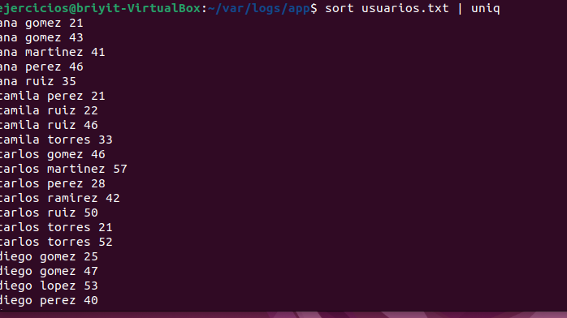
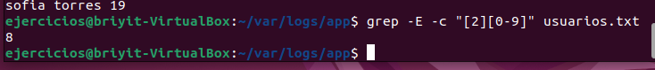
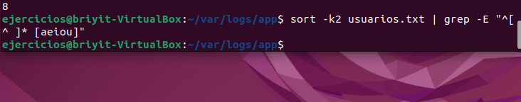
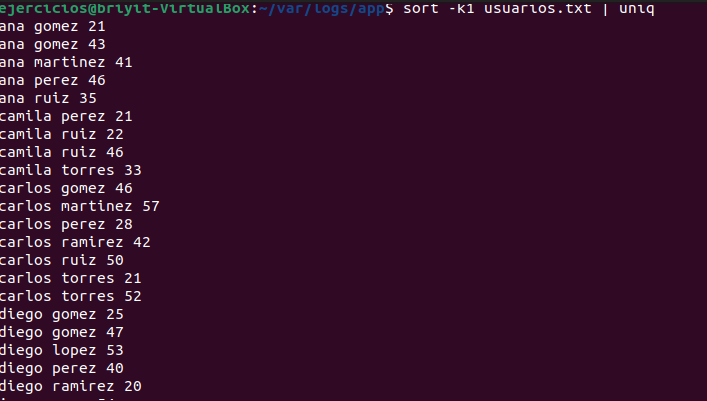

# Ejercicio 2 — Pipes, filtrado y ordenación
En un archivo llamado usuarios.txt tienes una lista desordenada de usuarios, algunos repetidos, con el siguiente formato:
--- 
- nombre apellido edad
Ejemplo:
```text
ana lopez 22
carlos ruiz 31
ana lopez 22
maria torres 19
```
--- 

Realiza las siguientes tareas usando pipes y comandos de filtrado:
1 Ordena el archivo por edad (columna 3) de forma numérica.
2 Muestra solo los usuarios únicos, sin duplicados.
3 Cuenta cuántos usuarios tienen edad entre 20 y 29, usando una regex con rangos [2][0-9].
4 Muestra únicamente los usuarios cuyo apellido empieza por vocal, usando grep -E.
5 Genera una lista ordenada alfabéticamente de nombres (columna 1), sin repetir.

---

## Ejercicio 2 – Documentación completa
1. Preparación del entorno
1.1. Acceso a la terminal
-Abrimos la terminal con `Ctrl + T` y accedemos al directorio de trabajo:

```bash
cd var/logs/app
```
1.2. Creación del archivo usuarios.txt 
- El archivo se generará automáticamente al ejecutar el código, por lo que no es necesario crearlo manualmente.

1.3. Primer intento de generación

```bash
usuario=("ana" "juan" "maria" "pedro" "laura" "carlos" "sofia" "diego" "camila")
for i in {1..40}; do
    echo "${usuario[$RANDOM % ${#usuario[@]}]}"
done >> usuarios.txt
```
1.4. Verificación del contenido

```bash
cat usuarios.txt
```
(Imagen 1)

1.5. Verificación de la existencia del archivo

```bash
ls -l

```
1.6. Segundo intento
Probé nuevamente con:

```bash
> usuarios.txt
usuarios=("ana" "juan" "maria" "pedro" "laura" "carlos" "sofia" "diego" "camila")
for i in {1..40}; do
    echo "${usuarios[$RANDOM % ${#usuarios[@]}]}"
done >> usuarios.txt

```
(Imagen 2)

1.7. Error detectado
- El formato generado no coincidía con el formato requerido por el ejercicio.

1.8. Generación correcta del archivo con nombre, apellido y edad
- Ejecuté el siguiente código corregido:

```bash
> usuarios.txt
nombres=("ana" "carlos" "maria" "pedro" "laura" "sofia" "diego" "camila" "juan")
apellidos=("lopez" "ruiz" "torres" "gomez" "martinez" "perez" "ramirez")
```

```bash
for i in {1..40}; do
    echo "${nombres[$RANDOM % ${#nombres[@]}]} ${apellidos[$RANDOM % ${#apellidos[@]}]} $((18 + RANDOM % 40))"
done >> usuarios.txt

```

1.9. Verificación del contenido
```bash
cat usuarios.txt
```
(Imagen 3)

1.10. Repetición del proceso para asegurar formato correcto
- Ejecuté nuevamente el mismo código.

1.11. Verificación final
```bash
cat usuarios.txt
```
(Imagen 4)

2. Solución del ejercicio
2.1. Ordenar numéricamente
- Probé:

```bash
sort -n usuarios.txt
```
- No hubo cambios porque los números están en la columna 3.

2.2. Ordenar por la columna 3 (edad)
```bash
sort -k3 -n usuarios.txt
```
- (Imágenes 5 y 6)

2.3. Eliminar líneas duplicadas
```bash
sort usuarios.txt | uniq
```
- (Imagen 7)

2.4. Contar cuántas edades están entre 20 y 29
```bash
grep -E -c "[2][0-9]" usuarios.txt
```
- (Imagen 8)

2.5. Filtrar apellidos que empiezan por vocal
```bash
sort -k2 usuarios.txt | grep -E "^[^ ]* [aeiou]"
```
- Explicación del patrón:
- ^[^ ]* → primera palabra (nombre)
- espacio
- [aeiou] → apellido que empieza por vocal
- (Imagen 9)

2.6. Lista ordenada alfabéticamente por nombre, sin repetir
```bash
sort -k1 usuarios.txt | uniq
```
- (Imagen 10)

---
- IMAGEN 1
- 
---
- IMAGEN 2
- 
 ---
- IMAGEN 3
- 
 ---
- IMAGEN 4
- 
 ---
- IMAGEN 5
-  
---
- IMAGEN 6
- 
---
- IMAGEN 7
- 
---
- IMAGEN 8
- 
---
- IMAGEN 9
- 
---
- IMAGEN 10
- 
