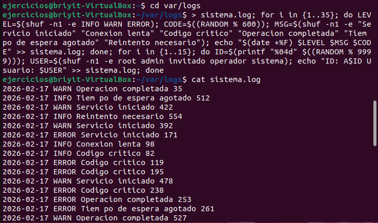
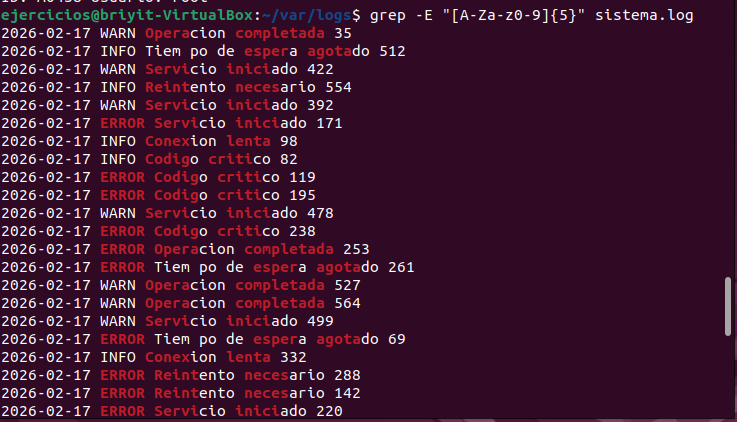
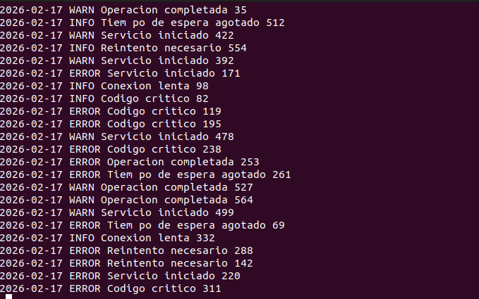
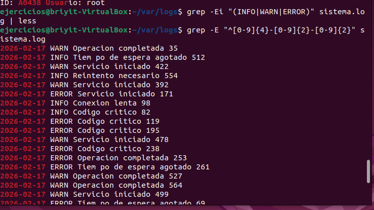
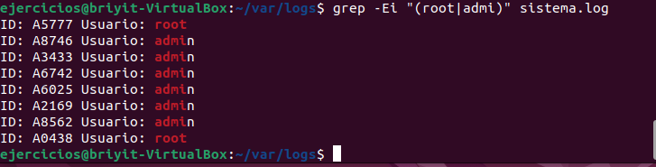

# Ejercicio 3 — Regex avanzadas con ERE
En el archivo sistema.log hay líneas con distintos formatos, por ejemplo:

```text
2024-01-01 INFO Servicio iniciado
2024-01-01 WARN Conexión lenta
2024-01-01 ERROR Código 503
ID: A1234 Usuario: root
ID: B9876 Usuario: admin
```

Realiza las siguientes tareas:
- Extrae todas las líneas que contengan códigos alfanuméricos de 5 caracteres, usando [A-Za-z0-9]{5}.
- Muestra solo las líneas cuyo mensaje sea INFO, WARN o ERROR, usando grupos ( ) y alternancia |.
- Filtra las líneas que empiezan por una fecha válida usando:^[0-9]{4}-[0-9]{2}-[0-9]{2}
- Obtén todas las líneas donde el usuario sea root o admin, usando:(root|admin)

---

## Ejercicio 3 — Análisis de logs con regex 
1. Organización del entorno
1.1 Abrir la terminal `Ctrl + Alt + T`
1.2 Movernos a la carpeta donde crearemos el archivo
```bash
cd /var/log
```
1.3 Crear el archivo sistema.log con 50 líneas aleatorias
```bash
> sistema.log; for i in {1..35}; do LEVEL=$(shuf -n1 -e INFO WARN ERROR); CODE=$((RANDOM % 600)); MSG=$(shuf -n1 -e "Servicio iniciado" "Conexión lenta" "Código crítico" "Operación completada" "Tiempo de espera agotado" "Reintento necesario"); echo "$(date +%F) $LEVEL $MSG $CODE" >> sistema.log; done; for i in {1..15}; do ID=$(printf "%04d" $((RANDOM % 9999))); USER=$(shuf -n1 -e root admin invitado operador sistema); echo "ID: A$ID Usuario: $USER" >> sistema.log; done
```
- Este comando genera un archivo con el formato requerido **(imagen 1)**.

2. Solución del ejercicio
2.1 Extraer códigos alfanuméricos de 5 caracteres
```bash
grep -E "[A-Za-z0-9]{5}" sistema.log
```
- Resultado mostrado en **imagen 2**.

2.2 Mostrar líneas con INFO, WARN o ERROR (ignorando mayúsculas/minúsculas)
```bash
grep -Ei "(INFO|WARN|ERROR)" sistema.log | less
```
Para salir de less: `q`

- Resultado mostrado en **imagen 3**.

2.3 Mostrar solo las líneas que empiezan con una fecha válida
```bash
grep -E "^[0-9]{4}-[0-9]{2}-[0-9]{2}" sistema.log
```
- Resultado mostrado en **imagen 4**.

2.4 Filtrar líneas donde el usuario sea root o admin
```bash
grep -Ei "(root|admin)" sistema.log
```
Resultado mostrado en **imagen 5**.

--- 
**imagen 1**
- 
---
**imagen 1**
- 
---
**imagen 1**
- 
---
**imagen 1**
- 
---
**imagen 1**
- 
---
