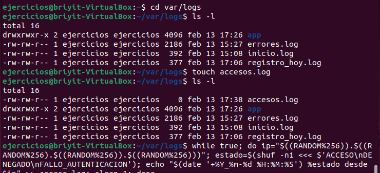
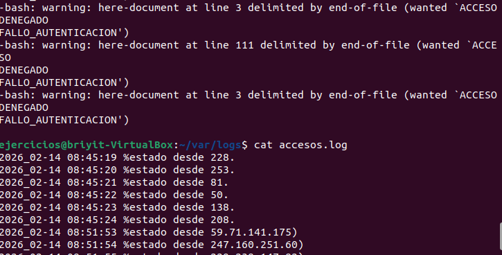
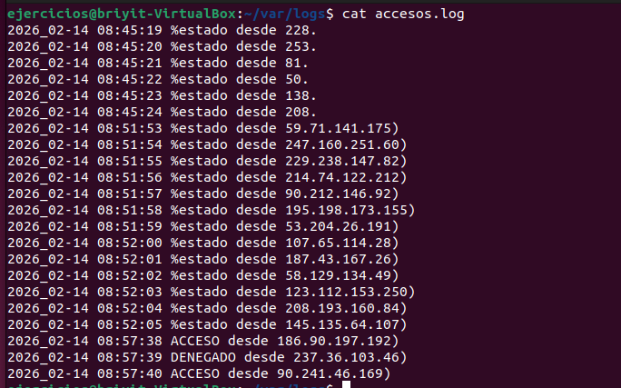
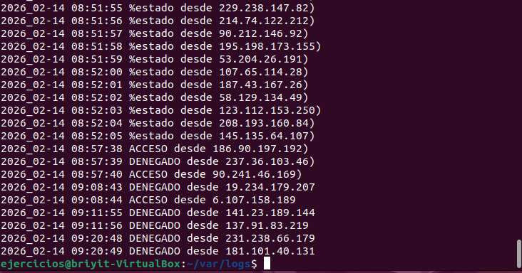
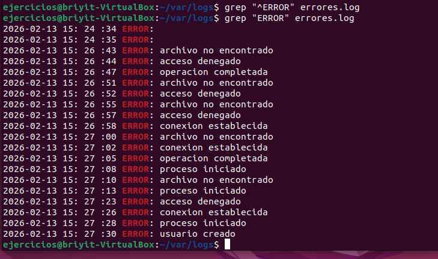
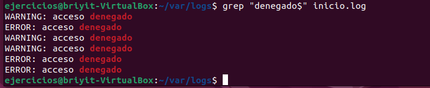
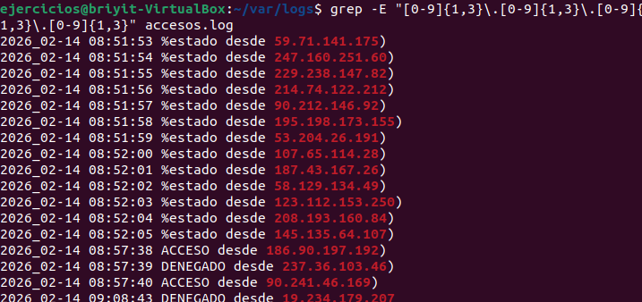
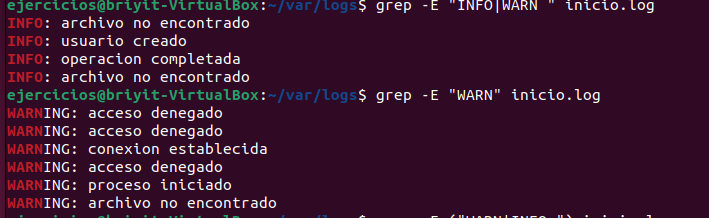
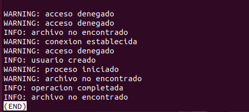
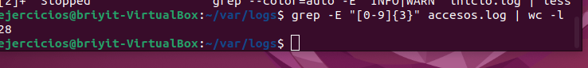

# Ejercicio 1 — Análisis de logs con grep y regex
En una carpeta llamada logs/ tienes los siguientes archivos:
- inicio.log
- errores.log
- accesos.log
---
Cada archivo contiene líneas con distintos formatos, incluyendo:
- Fechas
- Códigos de error
- Mensajes de INFO, WARN y ERROR
- Direcciones IP
---
Realiza las siguientes tareas:
1. Muestra únicamente las líneas que empiezan por ERROR en errores.log.
2. Obtén todas las líneas que terminan en denegado dentro de inicio.log.
3. Busca en accesos.log todas las líneas que contengan una dirección IP válida usando una regex con cuantificadores {1,3}.
4. Filtra todas las líneas que contengan INFO o WARN, usando alternancia | con grep -E en inicio.log
5. Cuenta cuántas líneas contienen números de 3 dígitos consecutivos en accesos.log

## Ejercicio 1 – Documentación

1. Inicio de la terminal y comprobación del directorio
1.1. Abrí la terminal con `Ctrl + T`.
1.2. Comprobé los tipos de archivo y verifiqué si coincidían con los del ejercicio.
  -Entré en el directorio correspondiente:

```bash
cd var/logs
```
1.3. Listé los archivos dentro de la carpeta logs.
1.4. Observé que accesos.log no existía en el directorio.
1.5. Creé el archivo:

```bash
touch accesos.log
```

1.6. Este archivo debía contener direcciones IP, ya que los archivos creados en el ejercicio anterior tenían esos requisitos. Lo único que faltaba era generar la IP.
1.7. Ejecuté el siguiente bucle para generar entradas con fecha, estado e IP:

```bash
while true; do ip="$((RANDOM%256)).$((RANDOM%256)).$((RANDOM%256)).$((RANDOM%256))"; estado=$(shuf -n1 <<< $'ACCESO\nDENEGADO\nFALLO_AUTENTICACION'); echo "$(date '+%Y-%m-%d %H:%M:%S') $estado desde $ip" >> accesos.log; sleep 1; done
```
(ver imagen 1)

1.8. Al escribirlo por primera vez cometí errores, lo que generó un resultado incorrecto. Aun así pude ver cómo se ejecutaba el código.
(ver imagen 2)

1.9. Como la ejecución no era correcta y se había creado un archivo con nombre incorrecto, lo eliminé:

```bash
rm acceso.log
```
1.10. Revisé el contenido de accesos.log:

```bash
cat accesos.log
```
- Vi que el código había corrido, pero con errores.

1.20. Verifiqué nuevamente el código para asegurarme de que estuviera bien escrito.
1.21. Llegué a la conclusión de que:
- El código corregido sí se estaba ejecutando bien.
- Pero el archivo accesos.log seguía teniendo líneas viejas del primer intento.
- Por eso parecía que seguía fallando, aunque ya estaba funcionando correctamente.
- Finalmente, se generaron líneas nuevas con la hora correcta.
- (ver imagen 4)

2. Solución del ejercicio
2.1. Buscar líneas que empiecen por ERROR
```bash 
grep "^ERROR" errores.log
```
- No apareció nada.
- Luego probé:

```bash
grep "ERROR" errores.log
```
- Y sí aparecieron líneas, lo que me confirmó que el archivo contenía errores.
- (imagen 5)

2.2. Buscar líneas que terminen en “denegado”
```bash
grep "denegado$" inicio.log
```
- (imagen 6)

2.3. Buscar direcciones IP válidas con regex
```bash 
grep -E "[0-9]{1,3}\.[0-9]{1,3}\.[0-9]{1,3}\.[0-9]{1,3}" accesos.log
```
- (imagen 7)

2.4 Buscar INFO o WARN
```bash
grep -E "INFO|WARN" inicio.log
```
- Al principio solo veía INFO y pensé que había un error.
- Probé:

``` bash
grep -E "WARN" inicio.log
```
- Y sí aparecieron las líneas WARNING.
- Finalmente entendí que la terminal no mostraba todo de golpe, así que usé:

```bash
grep -E "INFO|WARN" inicio.log | less
```
- El comando estaba correcto.
(imágenes 8 y 9)

2.5 Contar líneas con tres dígitos consecutivos
```bash
grep -E "[0-9]{3}" accesos.log | wc -l
```
- Resultado: 28 líneas contienen tres números seguidos.
(imagen 10)

**Listado de imágenes**
---
- Imagen 1
- 
---
- Imagen 2
- 
---
- Imagen 3
- 
---
- Imagen 4
- 
---
- Imagen 5
- 
---
- Imagen 6
- 
---
- Imagen 7
- 
---
- Imagen 8
- 
---
- Imagen 9
- 
---
- Imagen 10
- 
---
