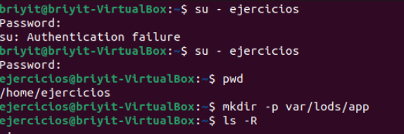
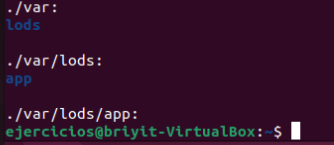
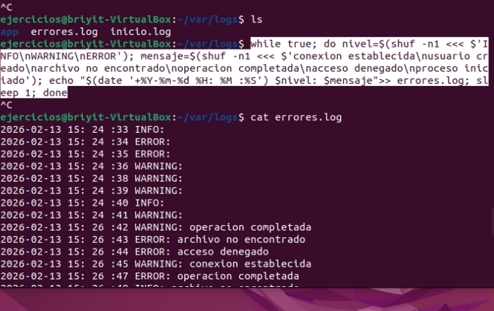
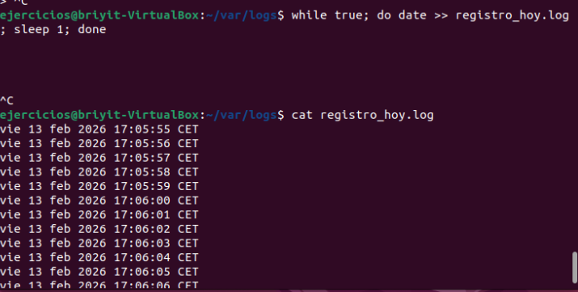
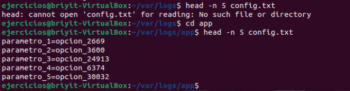
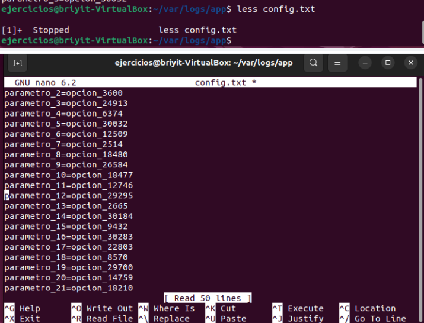
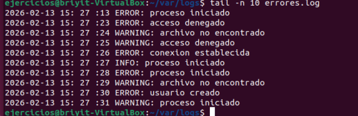
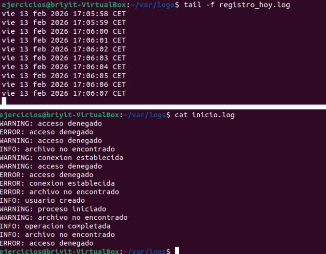
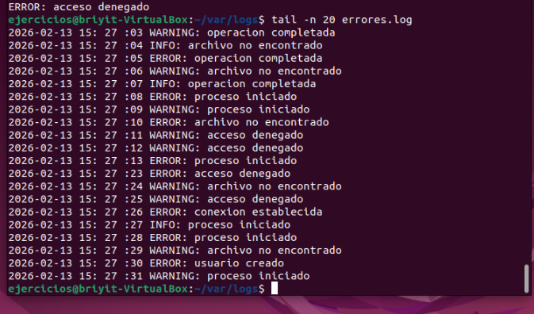

# Ejercicio: Lectura y exploración de archivos en Linux
Imagina que estás trabajando en un servidor y tienes los siguientes archivos dentro del directorio var/logs/app/:
  - inicio.log (archivo pequeño con 15 líneas)
  - errores.log (archivo muy grande que crece constantemente)
  - config.txt (archivo de configuración con 50 líneas)
  - registro_hoy.log (archivo que se actualiza en tiempo real)
- Comandos de la unidad a practicar:
  cat, head, tail, less, tail -f.

Tareas:
  - Comprueba rápidamente si el archivo inicio.log contiene la palabra “OK” en sus primeras líneas.
  - Visualiza solo las primeras 5 líneas del archivo config.txt.
  - Abre el archivo config.txt para navegarlo página por página y buscar dentro la palabra “timeout”.
  - Revisa únicamente las últimas 10 líneas del archivo errores.log sin mostrarlo completo.
  - Monitorea en tiempo real el archivo registro_hoy.log para ver si aparecen nuevas entradas.
  - Muestra el contenido completo de inicio.log de una sola vez, ya que es un archivo pequeño.
  - Consulta las últimas 20 líneas de errores.log sin abrirlo en un visor.

  ## Solucion

 **1. Preparación de la terminal**
- Accedo a la terminal con `Ctrl + T.`
- Cambio de usuario con:

```bash
su - ejercicios
```

- Ingreso la clave del usuario.
- Con `pwd` verifico en qué parte del directorio me encuentro.

**2. Recreación del directorio con sus archivos correspondientes**

```text 

/home/ejercicios/
 ├── logs/
 │    ├── inicio.log
 │    ├── errores.log
 │    └── registro_hoy.log
 └── appmd
      └── config.txt
```

2.1 Creo las carpetas con:

- mkdir -p var/logs/app/
- **No** uso sudo porque estoy creando directorios dentro de mi carpeta de usuario, no accediendo al /var real del sistema.
**(Recordar que las carpetas del sistema /var contienen información sensible).**

- ver imagen 1 

2.2
- Compruebo que se crearon correctamente:
```bash
ls -R
```

- ver imagen 2

2.3
- Corrijo un error en el nombre de la carpeta:
```bash
mv lods logs
```
2.4
- Creo el archivo:
```bash
touch inicio.log
```
2.5
- Genero 15 líneas aleatorias dentro del archivo:
```bash
for i in {1..15}; do echo "Mensaje aleatorio $RANDOM"; done > inicio.log
```
2.6
- Pruebo otro código para generar líneas más realistas:
```bash
for i in {1..15}; do nivel=$(shuf -n1 <<< $'INFO\nWARNING\nERROR'); mensaje=$(shuf -n1 <<< $'conexion establecida\nusuario creado\narchivo no encontrado\noperacion completada\nacceso denegado\nproceso iniciado'); echo "$nivel: $mensaje"; done > inicio.log
```
2.7
- Creo el archivo de errores:
```bash
touch errores.log
```
2.8
-Código para generar un archivo grande que crece constantemente:
```bash
while true; do nivel=$(shuf -n1 <<< $'INFO\nWARNING\nERROR'); mensaje=$(shuf -n1 <<< $'conexion establecida\nusuario creado\narchivo no encontrado\noperacion completada\nacceso denegado\nproceso iniciado'); echo "$(date '+%Y-%m-%d %H:%M:%S') $nivel: $mensaje" >> errores.log; sleep 1; done
```
2.9
Corregimos el código: el error fue escribir "shud" en lugar de "shuf".


ver imagen 3
2.10
-Subimos a la carpeta app con:
```bash
cd logs/app
```

2.11
-Creamos el archivo:
```bash
touch registro_hoy.log
```
2.12
- Generamos un archivo que se actualiza en tiempo real:
```bash
while true; do date >> registro_hoy.log; sleep 1; done
```

- ver imagen 4

**3. Resolución del ejercicio**
1. Buscar la palabra “OK” en inicio.log
```bash
grep "^OK" inicio.log
```
-Para buscar “OK” aunque haya espacios antes:
```bash
grep "^[[:space:]]*OK" inicio.log
```
-Probé también:
```bash
grep "a" inicio.log
```

- Quería comprobar si el archivo funcionaba y si los comandos respondían.
- Como es la primera vez usando grep, no sabía que si no encuentra coincidencias simplemente no muestra nada.

- Hago otra prueba:

```bash
grep -i "^e" inicio.log
Mostrar las primeras 5 líneas
```


2. paso al siguiente punto del ejercicio
```bash
head -n 5 inicio.log
```
- Me aparece que el archivo no está en ese directorio.


- ver imagen 5
- Recuerdo que está en app, así que:
```bash
cd app
head -n 5 inicio.log
```
3. Navegar config.txt página por página

```bash
less config.txt
```
- Para salir: `Ctrl + Q`

- Volver a la carpeta logs : `cd -`

ver imagen 6

4. Ver las últimas 10 líneas de errores.log

```bash
tail -n 10 errores.log
```
- ver imagen 7

 5. Monitorizar registro_hoy.log
 ```bash
tail -f registro_hoy.log
```

6. Mostrar el archivo pequeño completo
 ```bash
cat inicio.log
```
- ver imagen 8

7.  Último paso: ver las últimas 20 líneas de errores.log
 ```bash
cat inicio.log
```
tail -n 20 errores.log

tail n 20

- ver imagen 9

### imagenes

1. 
2. 
3. 
4. 
5. 
6. 
7. 
8. 
9. 


