# EJERCICIO PRÁCTICO: Domina el comando find
## Escenario
Estás investigando un servidor y necesitas localizar archivos sospechosos.
Tu misión es construir los comandos find adecuados para cada caso.
---
### NIVEL 1 — Búsqueda básica
- Encuentra todos los archivos cuyo nombre contenga la palabra log.
- Encuentra todas las imágenes con extensión .jpg o .jpeg.
- Encuentra todos los archivos que no sean .png.

 1. `find . -name "*log*"`
- 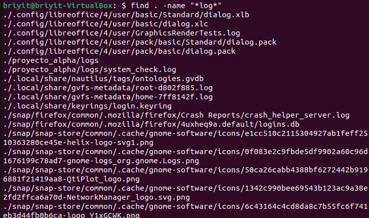
 2. `find . -name "*.jpg" -o -name "*.jpeg"`
- 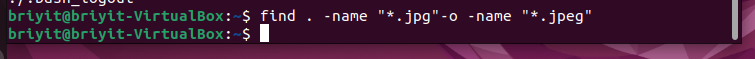
- descarge 2 imagenes porque en el sistema no habia imagenes
- 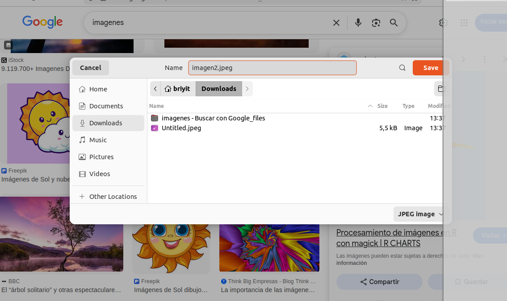
- 
- corregimos el comando estaba porque no tenia espacio en -o lo corregimos
  3. `find . -type f ! -name "*.png"`
- 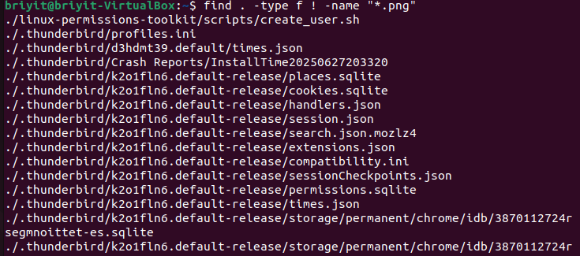
### NIVEL 2 — Búsqueda por tiempo
- Encuentra archivos modificados en las últimas 24 horas.
- Encuentra archivos modificados hace más de 30 días.
  
- find . -type f -mtime -1 (El - significa "menos de").
- 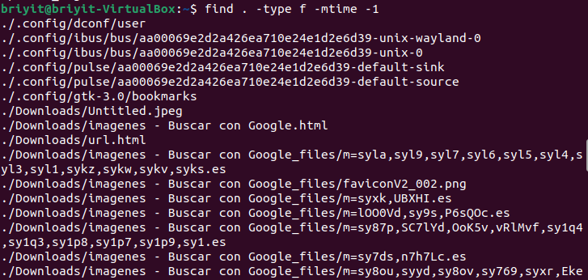
- find . -type f -mtime +30 (El + significa "más de").
- 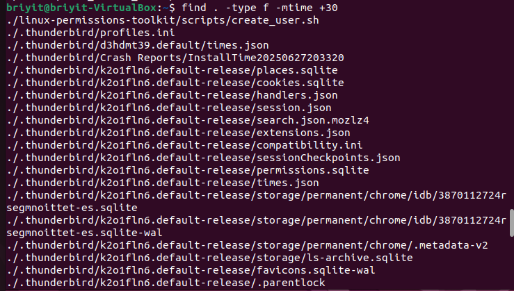

### NIVEL 3 — Búsqueda por tamaño
- Encuentra archivos mayores de 1 MB.
- Encuentra archivos menores de 10 KB.

- find . -type f -size +1M
- 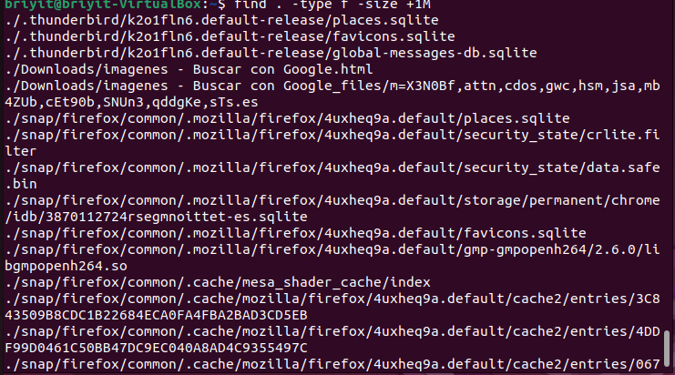
- find . -type f -size -10k
- 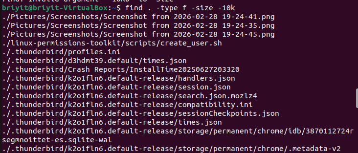
### NIVEL 4 — Búsqueda por permisos
- Encuentra archivos con permisos 777.
- Encuentra archivos que sean ejecutables.

- find . -perm 777
- 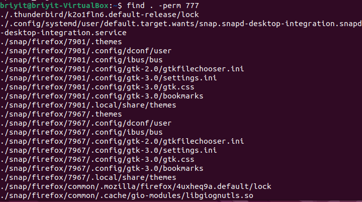
- find . -executable
- 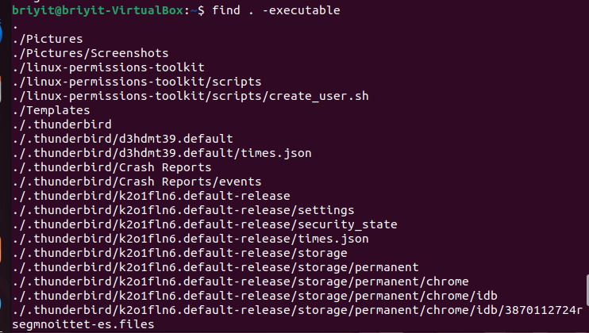
  
### NIVEL 5 — Archivos sospechosos
- Encuentra todos los scripts .sh dentro de la carpeta temp.

- find /tmp -name "*.sh"
- 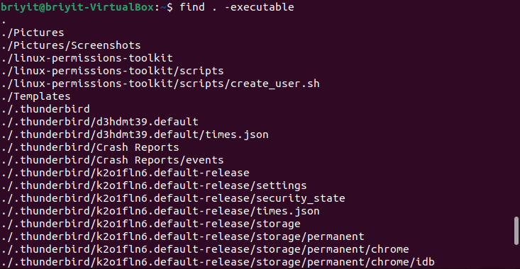

### NIVEL 6 — Buscar y eliminar (simulado)
- Muestra qué archivos .txt serían eliminados, pero sin borrarlos.
- Ahora sí, elimina los .txt dentro de temp.

- find /tmp -name "*.txt"
- 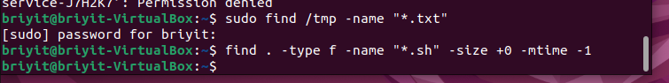
- no hay archivos para wliminar 

### NIVEL 7 — Desafío final: “Encuentra al intruso”
- Construye un solo comando find que encuentre un archivo que cumpla todas estas condiciones:
- Es un archivo .sh
- Tiene más de 0 bytes
- Fue modificado en las últimas 24 horas

- find . -type f -name "*.sh" -size +0 -mtime -1
- 

### Vamos a "fabricar" los resultados
Para el Nivel 6 (Crear un TXT en temp):
- touch /tmp/archivo_prueba.txt
- sudo find /tmp -name "*.txt"
- 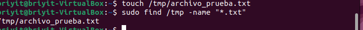

--- 
### DEsafio final
- echo "echo hola" > intruso.sh
- 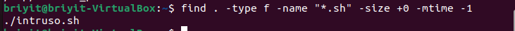

