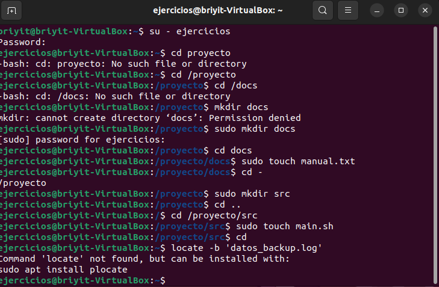
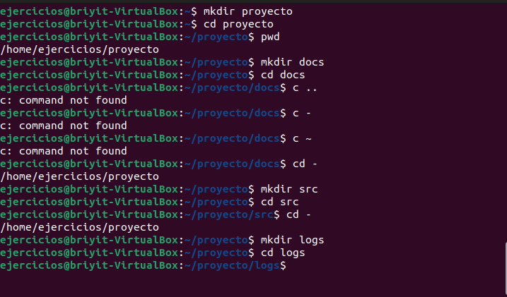
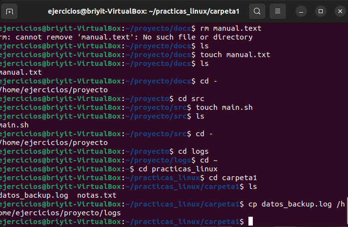
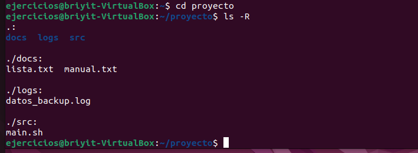

Objetivo de este ejercicio:

```text

/Proyecto
    |______/docs
    |         |___ lista.txt
    |         |___ maual.txt
    |
    |_____/logs
    |        |__ datos_backup.log
    |_____/src
            |__ main.sh

```

Recrear esta estructura , con los comandos aprendidos. 

Registro del ejercicio en terminal
1. Acceso al usuario de trabajo
- Inicio sesión con `su - ejercicios` e ingreso la contraseña.
- Este es el usuario asignado para las prácticas, así que confirmo mi ubicación con `pwd`.

2. Primeros intentos de navegación
- Intento entrar en `cd proyecto`, pero el sistema indica que no existe.
- Pruebo `cd /proyecto` pensando que quizá estaba en la raíz, pero tampoco existe.
- Intento `cd /docs`, pero la carpeta no estaba creada.

3. Intento de creación sin permisos
- Trato de crear docs con `mkdir docs`, pero aparece un error de permisos.

4. Uso de sudo para continuar
-Interpreto que necesito permisos elevados y uso `sudo mkdir docs`.
Accedo con `cd docs` y creo manual.txt con `sudo touch manual.txt`.
Regreso con `cd -` y repito el proceso para crear src.
Dentro de src creo main.sh con `sudo touch main.sh`.


**INCIDENCIA**— Confusión con rutas y creación accidental de carpetas
- Intento volver al home, pero escribo `cd ~ /proyecto`, lo cual falla porque esa ruta no existe.
- Intento mover /proyecto con `sudo mv /proyecto ~/proyect0`, pero al escribir mal el nombre termino generando otra carpeta.
- Compruebo con pwd y veo que existen practicas_linux y proyect0.
- Concluyo que el directorio “proyecto” nunca existió y que estaba creando archivos y rutas “fantasma” por errores de escritura.
Esta fue la incidencia principal del ejercicio.

5. Retomar el ejercicio correctamente
- Al día siguiente vuelvo a entrar con `su - ejercicios`.
- Confirmo con pwd que estoy en el usuario correcto.
- Creo el directorio real: `mkdir proyectos`.
- Verifico con `ls -l`.

6. Construcción correcta de la estructura
Creo proyecto dentro de proyectos:
- `mkdir proyecto`
- `cd proyecto`
- Confirmo con `pwd`
- Creo docs con `mkdir docs`.
- Practico `cd ..` y `cd -` para moverme.
- Creo src con `mkdir src` y entro con `cd src`.
Retrocedo y creo logs con `mkdir logs`.


7. Creación de archivos
- En docs verifico que debe existir manual.txt.
- En src creo main.sh con touch main.sh.
- En logs debe ir datos_backup.log, pero está en un ejercicio anterior.

8. Recuperación de archivos del ejercicio previo
Voy a` ~/practicas_linux/carpeta1` y copio:
- cp datos_backup.log /home/ejercicios/proyecto/logs
- En carpeta3 muevo lista.txt a docs:
- `mv lista.txt /home/ejercicios/proyecto/docs`



9. Verificación final
- Regreso a proyectos con `cd proyectos`.
- Compruebo toda la estructura con:`ls -R`




Confirmo que la organización de carpetas y archivos coincide con el objetivo del ejercicio.
