# “El Intruso Silencioso” — Permisos Especiales y Troubleshooting en Linux
En este laboratorio simulo un escenario donde un script aparentemente inofensivo intenta acceder a información sensible dentro de un directorio protegido. El objetivo es entender cómo funcionan los permisos especiales (SUID, SGID, Sticky Bit), cómo se comportan los binarios del sistema y cómo diagnosticar un “Permiso denegado” que, en teoría, no debería ocurrir.

## 1. Creación del entorno seguro
Primero creo un directorio donde se almacenará información sensible:

```bash
mkdir datos_sensibles
ls
```
-  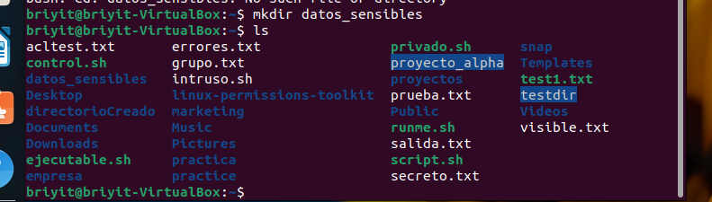

Ahora aplico permisos especiales:

```bash
chmod 3770 datos_sensibles
```
-  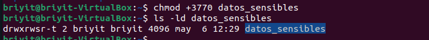

¿Por qué 3770?

3 → SGID (2) + Sticky Bit (1)

7 → permisos completos para el dueño

7 → permisos completos para el grupo

0 → nadie más entra

## 2. Crear el grupo de seguridad
Creo un grupo llamado confidencial:

```bash
sudo groupadd confidencial
```

Asigno el grupo al directorio:

```bash
sudo chgrp confidencial datos_sensibles
cd datos_sensibles
```
Creo un archivo secreto:

-  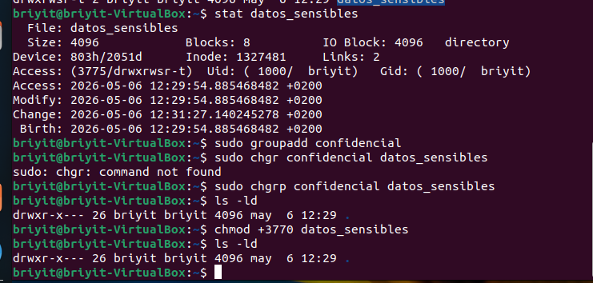

```bash
sudo sh -c 'echo "ESTE ES UN ARCHIVO SECRETO" > top_secret.txt'
```
-  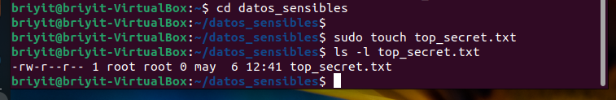

```bash
cat top_secret.txt
```
-  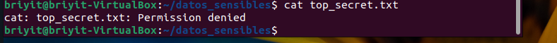

## 3. Creación del script “intruso”
Creo un script que intenta leer el archivo secreto:

```bash
nano intruso.sh
```
-  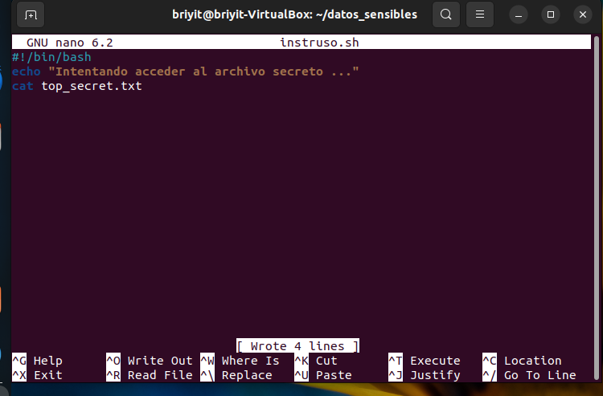

Contenido del script:

```bash
#!/bin/bash
echo "Intentando acceder al archivo secreto..."
cat top_secret.txt
```
Le doy permisos especiales:

```bash
sudo chmod u+s intruso.sh
```
-  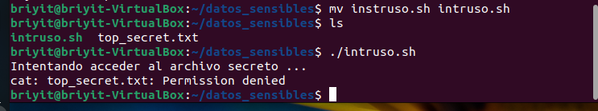
  
## 4. Ejecución del script y error
Al ejecutar:

```bash
./intruso.sh
```
Obtengo:

Permiso denegado

Esto ocurre porque el script tiene SUID, pero el binario que usa **(cat)** NO lo tiene.
El sistema no permite que un script escale permisos si el binario que ejecuta no tiene permisos elevados.

## 5. Escalando permisos de forma controlada (solo para laboratorio)
Para que el script pueda leer el archivo, necesito que /usr/bin/cat tenga SUID.

Primero verifico:

```bash
ls -l /usr/bin/cat
```
-  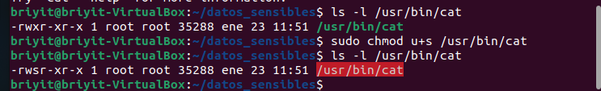

Ahora aplico SUID al binario:

```bash
sudo chmod u+s /usr/bin/cat
```
Ejecuto de nuevo:

```bash
./intruso.sh
```
-  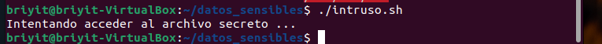

## 6. Revertir el cambio por seguridad
Nunca se debe dejar un binario del sistema con SUID activado.
Lo desactivo:

```bash
sudo chmod u-s /usr/bin/cat
```
-  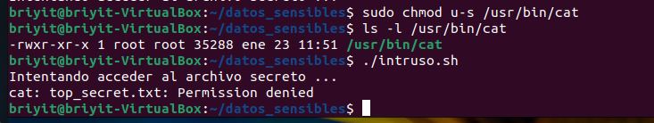

## 7. Verificación final
Para demostrar que el script realmente accedió al archivo, escribo algo dentro:

```bash
sudo sh -c 'echo "PROYECTO X: La contraseña de la caja fuerte es 12345" > top_secret.txt'
```
-  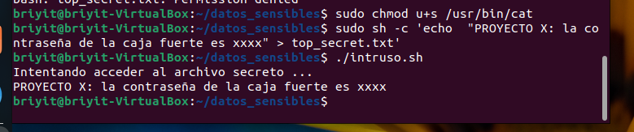

## Conclusiones del “El Intruso Silencioso”
En este laboratorio aprendí:
- Cómo funcionan los permisos especiales en Linux
- Por qué un script con SUID no siempre puede escalar permisos
- Que los binarios que usa el script también deben tener permisos adecuados
- Cómo diagnosticar un “Permiso denegado” que no parece lógico
- Por qué nunca se debe dejar un binario del sistema con SUID
- Cómo aplicar SGID + Sticky Bit para proteger directorios sensibles


