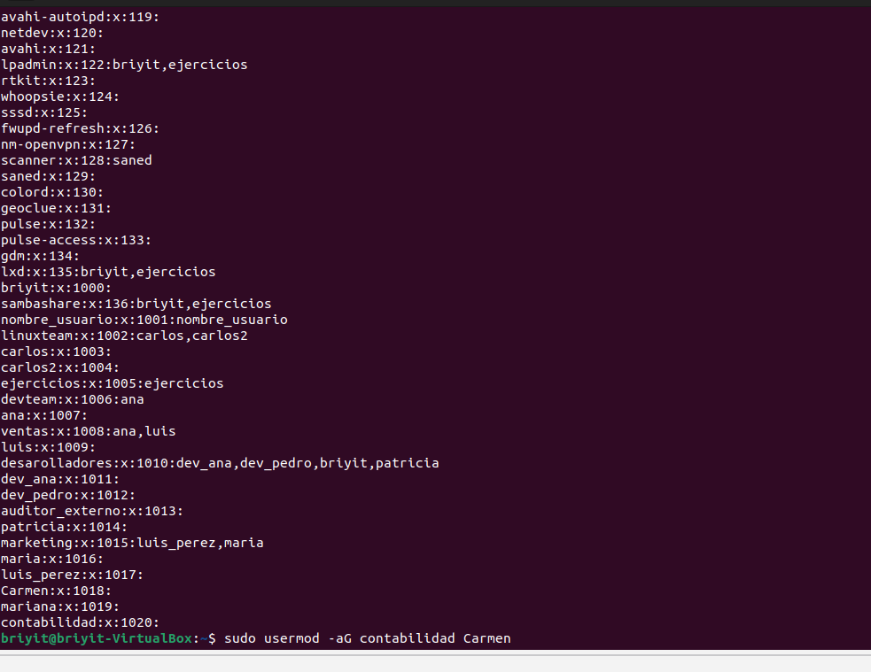
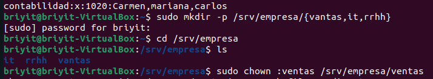
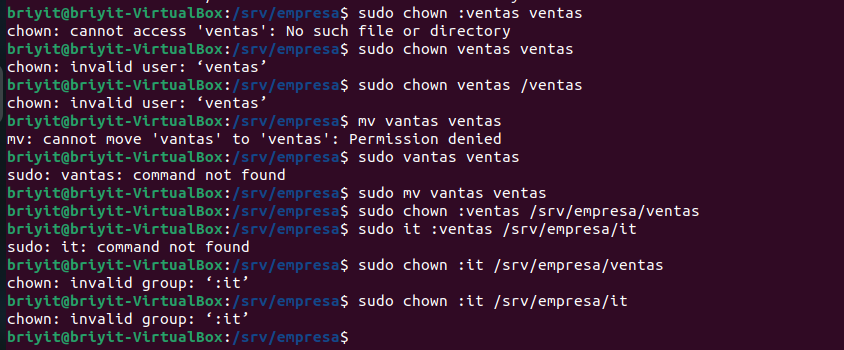
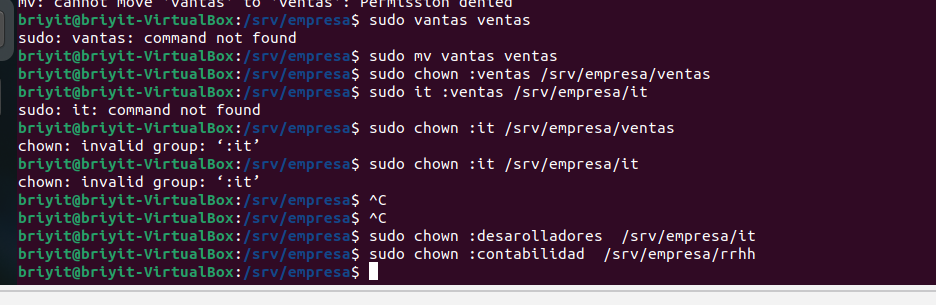
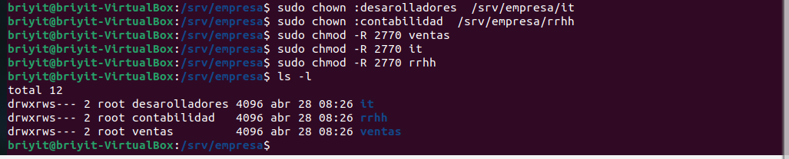
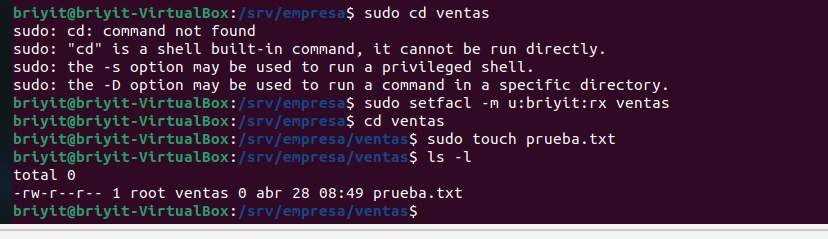
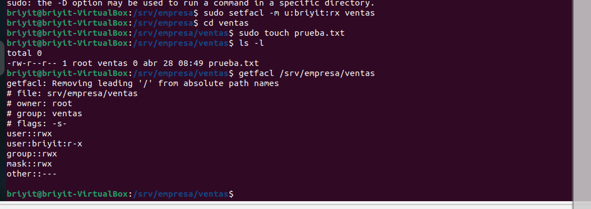
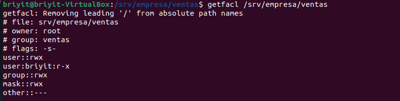

# Gestión de Identidades Empresarial (Usuarios, Grupos, Permisos, SGID, Sticky Bit y Estructura de Departamentos)
Trabajé en la creación de identidades dentro del sistema Linux, la gestión de grupos y la construcción de una estructura empresarial realista en /srv/empresa. 
El objetivo fue entender cómo se organiza un entorno multiusuario y cómo se aplican permisos profesionales en un sistema Linux.

## 1. Creación de usuarios y grupos
Para este ejercicio debía crear 10 usuarios y 5 grupos.
Mi intención era que cada usuario tuviera su propio directorio home y que los grupos representaran departamentos reales.

### Comandos base que utilicé
Crear un usuario con su home y shell Bash

```bash
sudo useradd -m -s /bin/bash nombre_usuario
sudo passwd nombre_usuario
```

- Crear un grupo
```bash
sudo groupadd nombre_grupo
```

Añadir un usuario a un grupo
Opción clásica (uno por uno):

```bash
sudo usermod -aG nombre_grupo usuario
```

Opción rápida (varios usuarios a la vez):

```bash
sudo gpasswd -m usuario1,usuario2,usuario3 nombre_grupo
```
- -m → define la lista completa de miembros
- Sobrescribe la lista anterior
- Ideal para configurar un departamento desde cero
- En la primera imagen se ve el resultado: los usuarios creados y los grupos correctamente registrados en /etc/group.
- 

## 2. Creación de la estructura empresarial en /srv/empresa
Para simular un entorno corporativo real, utilicé la ruta estándar /srv, que se usa para servicios y datos compartidos.

### 2.1 Crear las carpetas de los departamentos
```bash
sudo mkdir -p /srv/empresa/{ventas,it,rrhh}
```
- 

### 2.2 Asignar cada carpeta a su grupo correspondiente
```bash
sudo chown :ventas /srv/empresa/ventas
sudo chown :it /srv/empresa/it
sudo chown :rrhh /srv/empresa/rrhh
```
- 

En mi caso cometí un error: intenté asignar el grupo it, pero ese grupo no existía.
El grupo real era desarrolladores, por eso aparecía el error “invalid group”.
Una vez corregido, los comandos funcionaron sin problema.

```bash
sudo chown :desarolladores /srv/empresa/it
```

- 


### 3. Aplicación de permisos profesionales (2770 y SGID)
El objetivo era que cada departamento tuviera acceso exclusivo a su carpeta, y que los archivos creados dentro heredaran automáticamente el grupo del departamento.

Permisos aplicados
```bash
sudo chmod -R 2770 /srv/empresa/ventas
sudo chmod -R 2770 /srv/empresa/it
sudo chmod -R 2770 /srv/empresa/rrhh
```
- 

Esto garantiza que:
- Solo los miembros del departamento pueden entrar
- Los archivos creados dentro pertenecen automáticamente al grupo del departamento


- Intengo acceder pero como no hago parte del gtupo si intento acceder no podre
- `sudo detfacl -m u:briyit:rx ventas ` para concederme permisos
- 
- ```bash
  sudo detfacl -m u:briyit:rx ventas
  cd ventas
  sudo touch prueba.txt
  ls .l
  ```
  
- 

### Ver ACLs
```bash
getfacl /srv/empresa/ventas
```
- 
