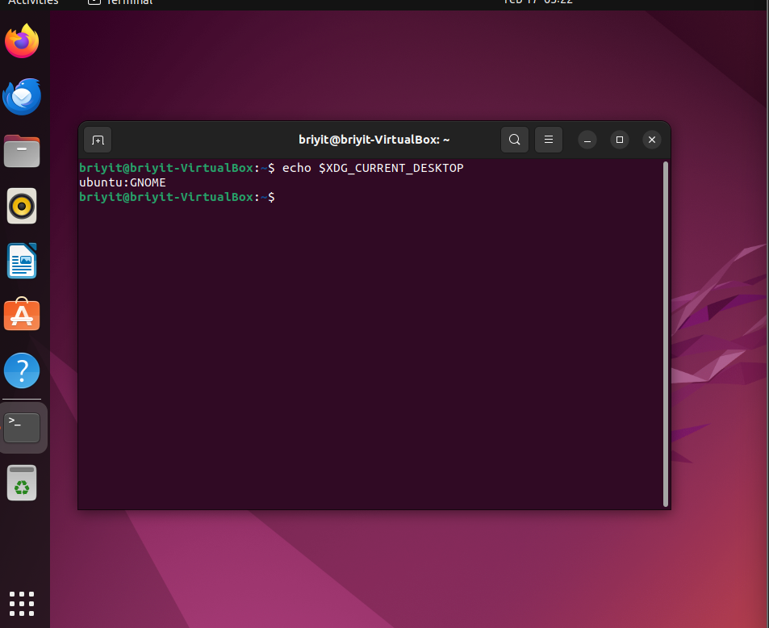
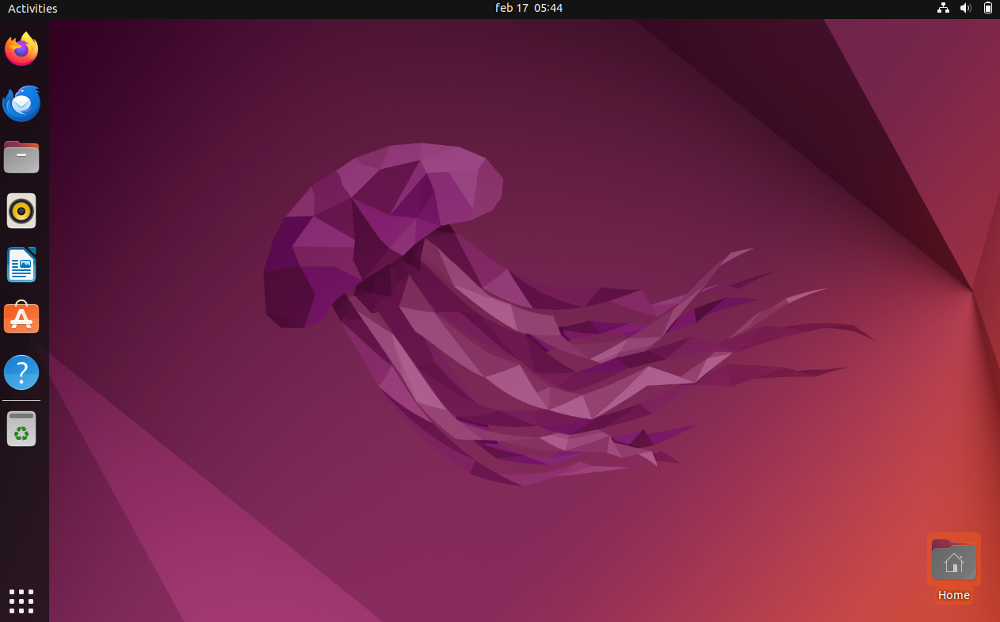
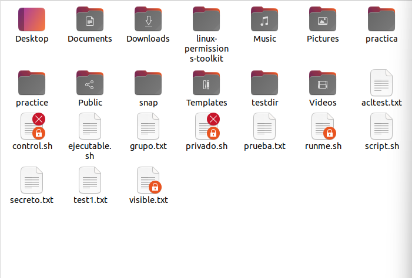
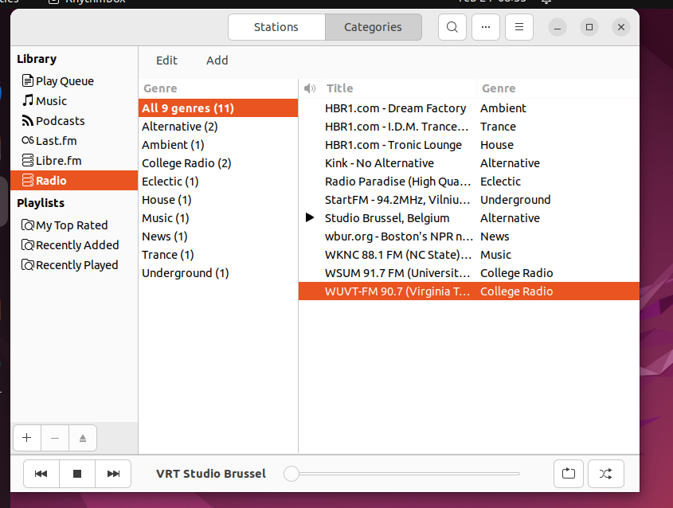
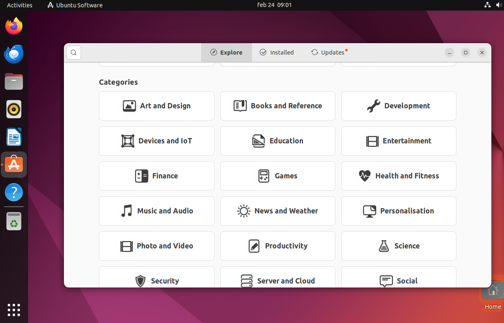
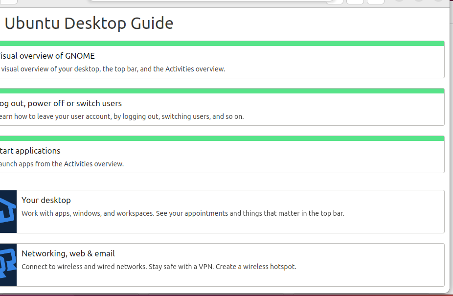
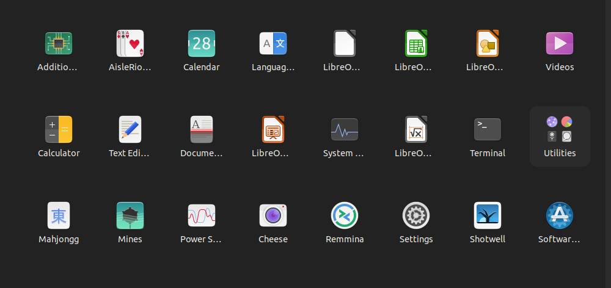
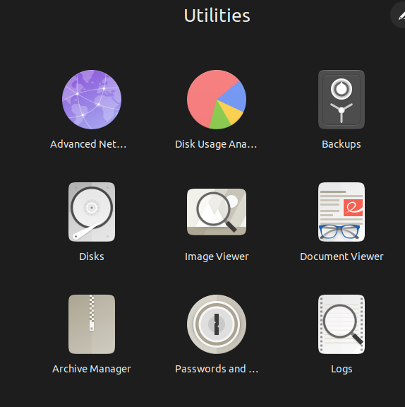
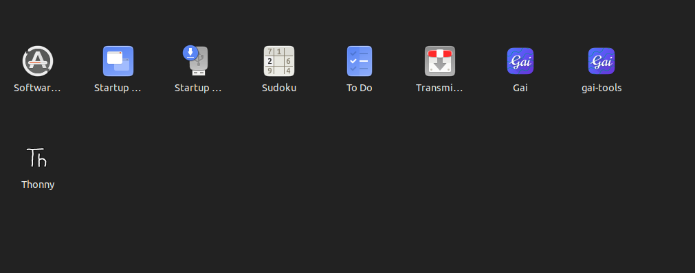

# Interfaz en Linux 

Es el (GUI) es la parte visual del sistema: ventanas,iconos,menùs, paneles. aplicaciones, etc.
Es lo que no ves en la terminal 

---
**Linux** puede tener diferentes escritorios, según la distribución:
- GNOME (Ubuntu, Fedora)
- KDE Plasma (Kubuntu)
- XFCE (Xubuntu)
- MATE
- Cinnamon (Linux Mint)

## 1. Elementos
1. **Escritorio**:es el fondo donde puedes
- poner archivos
- poner accesos directos
- cambiar el fondo de pantalla

1.1. **Barra superior o inferior**:depende del escritorio, pero normalmente incluye
   - hora
   - red
   - volumen
   - batería
   - menú de aplicaciones
      
2. **Menú de aplicaciones**:es como el “Inicio” de Windows.Desde aquí abres
- navegador
- terminal
- archivos
- Configuraciones
- programas instalados
3. **Ventanas**: Cada aplicación se abre en una ventana con:
 - botón cerrar
 - minimizar
 - maximizar
4. **Explorador de archivos**Se llama:
- Nautilus (`GNOME`)
- Dolphin (`KDE`)
- Thunar (`XFCE`)
---
**Sirve para:**
- navegar carpetas
- copiar/mover archivos
- crear carpetas
- eliminar archivos

## Puedes
1. **Navegar por carpetas** : Como en Windows, pero con rutas Linux:
  - /home
  - /etc
  - /usr
  - /var
- **Abrir aplicaciones**:Navegador, editor de texto, terminal, etc.
- **Configurar el sistema** :Red, sonido, pantalla, usuarios, idioma…
  
2.**Instalar programas**: Según la distribución:
- `Ubuntu` → Software Center
- `Fedora` → Discover
- `Linux Mint` → Gestor de software

3.**Usar la terminal**:La GUI siempre tiene un acceso a la terminal.

## Diferencias entre GUI y Terminal
|GUI | Terminal |
|:--|:--|
|Fácil, visual |Precisa, rápida |
|Ideal para principiantes | Ideal para administradores |
|Más lenta |Más poderosa |
|No siempre muestra todo | Control total |


---

La interfaz gráfica de **Linux** se parece mucho a Windows en lo visual:
- escritorio
- iconos
- ventanas
- barra de tareas
- menú de aplicaciones
---
El menú de aplicaciones es como el botón “Inicio” de Windows.En Linux puede llamarse:
- “Activities” (GNOME)
- “Menu” (XFCE)
- “Kickoff” (KDE)
- “Menu de Linux Mint” (Cinnamon)
Pero siempre sirve para lo mismo:

--- 
| GUI | Terminal |
|:--|:--|
|Visual |Texto | 
| Fácil | Precisa |
| Lenta | Rápida |
| Para usuarios | Para administradores |

---

## 2. CONFIGURACIÓN DEL SISTEMA DESDE LA INTERFAZ GRÁFICA
En **Linux**, la configuración gráfica se encuentra en:
- Configuración del sistema 
- Settings  
- Ajustes  
- System Settings
    Cuando lo abres, verás categorías como:
    - Red
    - Pantalla
    - Sonido
    - Usuarios
    - Energía
    - Actualizaciones
    - Bluetooth
    - Ratón y teclado
    - Es igual que en Windows, solo que organizado de otra forma.
      
### 2. Configuración de red 
Aquí puedes:
- conectarte al WiFi
- configurar red cableada
- ver la IP
- activar/desactivar redes
- cambiar DNS (muy útil)


### 3. Configuración de usuarios
Desde la interfaz gráfica puedes:
- crear usuarios
- cambiar contraseña
- cambiar foto de perfil
- activar/desactivar cuentas
- cambiar tipo de usuario (normal / administrador)

### 4. Configuración de pantalla
Aquí puedes:
- cambiar resolución
- cambiar brillo
- configurar varios monitores
- cambiar orientación
- cambiar fondo de pantalla
  
### 5. Configuración de sonido
Puedes:
- cambiar volumen
- elegir salida (altavoces, auriculares)
- elegir entrada (micrófono)
- probar dispositivos
  
### 6. Configuración de actualizaciones
En Ubuntu, por ejemplo:
- Software & Updates
- Actualizaciones automáticas
- Repositorios :desde aquí puedes:
- activar actualizaciones automáticas
- elegir servidores de descarga
- instalar drivers
### 7. Configuración de energía
Puedes:
- suspender
- hibernar
- apagar pantalla
- configurar batería
### 8. ¿Por qué es importante aprender esto si tú usarás terminal?
Porque Linux+ exige que conozcas ambos mundos:
- GUI
- Terminal
- Fácil
- Precisa
- Visual
- Rápida
- Para usuarios
- Para administradores
---
necesitas saber:
Dónde están las cosas en la GUI
cómo se hace lo mismo en terminal

---
¿Qué **NO** es la interfaz gráfica?
- La terminal
- La pantalla negra con comandos
- El modo texto
- El shell
- Eso es CLI (Command Line Interface).

---
Para identificar tu interfaz gráfica (entorno de escritorio) en Linux, utiliza el comando `echo $XDG_CURRENT_DESKTOP`

- Abre una terminal (Ctrl+Alt+T) y escribe:
```bash
echo $XDG_CURRENT_DESKTOP
```

- 


- Los paneles en la interfaz de Linux son barras (superiores, inferiores o laterales) que albergan el menú de aplicaciones, lanzadores, reloj y miniaplicaciones (applets),
- “Las actualizaciones en Ubuntu se realizan principalmente a través de la herramienta gráfica Actualizador de Software (Software Updater) o mediante la terminal usando los comandos sudo apt update y sudo apt upgrade.”


## Exploremos Ubuntu en nuestra maquina virtual

1.**Terminal**
- Nombre en `GNOME`: Terminal  
- Icono: una pantalla negra .Sirve para:
- ejecutar comandos
- administrar el sistema
- ver logs
- instalar paquetes
- Es la herramienta que más usarás como administradora.
2. **File Manager** (Explorador de archivos)
- Nombre en **GNOME**: Files (o “Archivos”)
- Icono: una carpeta
- Sirve para:
- navegar carpetas
- copiar/mover archivos
- ver propiedades
- montar unidades USB
- Aunque tú usarás terminal, debes saber dónde está.
 3. **Ubuntu Software** (Centro de software)
- Icono: una bolsa naranja
- Sirve para:
- instalar aplicaciones
- actualizar programas
- ver software disponible
- Es como la “Microsoft Store” de Ubuntu.
4. **Settings** (Configuración)
Icono: ⚙️
- Sirve para:
- red
- usuarios
- pantalla
- sonido
- energía
- privacidad
- Ya lo estás usando.
5. **Web Browser** (Navegador)
Normalmente: Firefox
Sirve para navegar, descargar, buscar documentación, etc.
6. **Document Viewer** (Visor de documentos)
- Nombre: `Document Viewer o Evince`
- Sirve para abrir PDFs.
7. **Text Editor** (Editor de texto simple)
- Nombre: `Text Editor o Gedit`
- Sirve para:
- abrir archivos de texto
- editar configuraciones simples
- tomar notas
- Más adelante aprenderás nano y vim, que son editores de terminal.
- Ubuntu trae LibreOffice preinstalado:
- Writer (como Word)
- Calc (como Excel)
- Impress (como PowerPoint)
---

- 
- como podemos ver en la imagen en la barra lateral de la izquierda esta.
#### Fire fox que es el navegador
#### Thunderbird en Ubuntu
- Gestionar tus correos electrónicos  
- Puedes añadir cuentas de Gmail, Outlook, Yahoo, ProtonMail (con configuración), etc.
- Organizar varios correos en un solo lugar  
- Si tienes varias cuentas, Thunderbird te permite verlas todas juntas sin tener que abrir el navegador.
- Trabajar sin conexión  
- Puedes leer y redactar correos incluso sin internet; se enviarán cuando vuelvas a conectarte.
- Calendario y tareas  
- Incluye un calendario tipo agenda para gestionar citas, recordatorios y eventos.
- Contactos  
- Guarda y sincroniza tus contactos.
- Extensiones y personalización  
- Puedes añadir complementos para mejorar funciones, cambiar el aspecto, añadir cifrado, etc.
- Privacidad y seguridad  
- Thunderbird es de código abierto y muy respetado por su enfoque en la seguridad.

#### File: donde podemos navegar entre carpetas, archivos etc 
- 
#### rhythbox : un reproductor de audio , radio 
- 

----
**Ubuntu usa LibreOffice para leer los archivos o crearlos , vemos libreoffice writer**
####  Aplicaciones principales de LibreOffice en Ubuntu
##### Writer
- Editor de textos (como Microsoft Word)
- Para cartas, trabajos, informes, CV, etc.
##### Calc
- Hoja de cálculo (como Excel)
- Para tablas, fórmulas, presupuestos, gráficos…
##### Impress
- Presentaciones (como PowerPoint)
- Para diapositivas, exposiciones, clases…
##### Draw
- Dibujo vectorial
- Para diagramas, mapas conceptuales, folletos, carteles…
##### Math
- Editor de fórmulas matemáticas
- Útil para documentos científicos o educativos.
##### Base
- Base de datos (como Access)
- No siempre viene instalado por defecto, depende de la versión.
- los iremos viendo a medida que exploremos mas en la interfaz

---


- 
###### ubuntu software
Es la `tienda de aplicaciones de Ubuntu`: Permite buscar, instalar, actualizar y desinstalar programas fácilmente.
- Incluye apps como navegadores, ofimática, juegos, utilidades, herramientas de desarrollo y más.
- Todo desde una interfaz gráfica sencilla, sin usar la terminal.

- muchas aplicaciones de Ubuntu son distintas a las de Windows porque Ubuntu usa software pensado para Linux.
- Aun así, hacen lo mismo: navegar, escribir, escuchar música, etc.
- ¿Quién hace estas aplicaciones?
   - La mayoría están hechas por:
   - Comunidades de desarrolladores
   - Proyectos de software libre, fundaciones (como The Document Foundation, Mozilla, etc.)
- Pudimos encontrar:
- **rt-tests (Real Time Test Suite)**
   - Es un conjunto de herramientas para probar el rendimiento en tiempo real del sistema.
   - Se usa para medir:
   - Latencia
   - Respuesta del sistema
   - Estabilidad
   - Es técnico, más para ingenieros o administradores de sistemas.

- Apache: servidor web para publicar páginas.
- Ant: herramienta para automatizar proyectos Java.
- NetBeans: IDE para programar (Java, PHP, etc.).
- Anbox Cloud: ejecutar apps Android en la nube.
- Eclipse: IDE para muchos lenguajes.
- Ruby: lenguaje de programación fácil y potente.


- ¿Son de código abierto?
En su mayoría sí, son de código abierto.
Eso significa:
Cualquiera puede ver cómo están hechas.
Se pueden mejorar, modificar y compartir.
Son gratuitas y seguras.


| Ubuntu | Windows |
|:--|:--|
| Firefox / Chromium | Chrome / Edge |
|LibreOffice | Microsoft Office |
|Thunderbird | Outlook |
|GIMP | Photoshop |
|VLC | VLC (este está en ambos)|


##### help: es un manual explicativo de como usar este distro Ubuntu de linux 



---
por ultimo encontramos.
##### Trash
Es el directorio de almacenamiento temporal donde se mueven los archivos eliminados por el usuario antes de su eliminación permanente

- 
- damos click en show applications


-**Fila 1**
1. **Additional Drivers**: Sirve para instalar controladores adicionales (drivers) para tu hardware: Wi‑Fi, gráficos, impresoras, etc.
2. **AisleRiot Solitaire**:Juego de solitario clásico.
3. **Calendar**:Aplicación de calendario para gestionar eventos y recordatorios.
4. **Language Support**:Configura idiomas, diccionarios, teclados y paquetes de traducción del sistema.
5. **LibreOffice Writer**:Procesador de texto (como Word).
6. **LibreOffice Calc**: Hoja de cálculo (como Excel).Para tablas, fórmulas, análisis básico de datos.
7. **LibreOffice Impress**:Presentaciones (como PowerPoint).Para diapositivas, exposiciones, trabajos visuales.
8. **Videos**: Reproductor de video del sistema (antes llamado Totem).

-**Fila 2**
1. **Calculator**:Calculadora básica y científica.
2. **Text Editor**:Editor de texto simple (como Notepad).Para notas rápidas o editar archivos de configuración.
3. **Document Scanner**:Para escanear documentos usando un escáner o impresora multifunción.
4. **LibreOffice Draw**: Programa de dibujo vectorial.Útil para diagramas, mapas conceptuales, folletos.
5. **System Monitor**:Muestra el uso de CPU, RAM, procesos y rendimiento del sistema.
6. **LibreOffice Math** :Editor de fórmulas matemáticas.Se usa dentro de Writer o Impress.
7. **Terminal** :Consola de comandos.Permite administrar el sistema de forma avanzada.

- **Utilities**
- Carpeta que agrupa herramientas pequeñas del sistema (discos, capturas, etc.).

- 
1. **Advanced Network Configuration**
- Configura conexiones de red avanzadas.
-  crear perfiles de red, VPN, conexiones cableadas, Wi‑Fi con parámetros técnicos.
- Es útil cuando necesitas ajustes más detallados que los de “Settings”.
2. **Disk Usage Analyzer**
- Analiza cuánto espacio ocupa cada carpeta en tu disco.
- Muestra gráficos para ver qué archivos están llenando el almacenamiento.
- Ideal para limpiar el sistema.
3. **Backups**
- Herramienta para hacer copias de seguridad automáticas.
- Guarda tus documentos, fotos y configuraciones en otro disco o en la nube.
- Te permite restaurar archivos si los pierdes.
4.**Disks**
- Administra discos duros, SSDs, USBs y particiones.
- Permite:
- Formatear
- Crear particiones
- Probar el estado del disco (SMART)
- Montar y desmontar unidades
- Es una herramienta potente del sistema.
5.**Image Viewer**
- Visor de imágenes simple.
- Abre fotos en formatos como JPG, PNG, GIF.
- Permite rotar, acercar y ver metadatos.
6. **Document Viewer**
- Visor de PDF, archivos de cómics (CBR/CBZ) y documentos similares.
- Es ligero y rápido, ideal para leer.
7. **Archive Manager**
- Maneja archivos comprimidos: ZIP, RAR, TAR, 7z, etc.
- Permite:
- Comprimir
- Descomprimir
- Crear archivos comprimidos
- Es como WinRAR o 7‑Zip en Windows.
8. **Passwords and Keys**
- Gestor de claves, certificados y contraseñas del sistema.
- Guarda contraseñas de Wi‑Fi, claves SSH, tokens, etc.
- Es parte del sistema de seguridad de Ubuntu.
9. **Logs**
- Muestra los registros del sistema.
- Sirve para ver errores, fallos, advertencias y eventos del sistema.
- Muy útil para diagnosticar problema


- **Fila 3**
1. **Mahjongg** :Juego de Mahjong clásico.
**Mines** :Juego tipo Buscaminas.
**Power Statistics**: Muestra estadísticas de batería y energía del sistema.
**Cheese** :Programa para usar la cámara web y tomar fotos o videos.
**Remmina** :Cliente de escritorio remoto.Sirve para conectarte a otras computadoras (RDP, VNC, SSH).
**Settings** :Configuración del sistema: Wi‑Fi, pantalla, sonido, usuarios, etc.
**Shotwell** :Gestor de fotos.Para organizar, ver y editar imágenes básicas.
**Software & Updates** :Para instalar programas, actualizar el sistema y gestionar repositorios.

- **Fila 4**
- 

##### 1. Software
- Es la tienda de aplicaciones de Ubuntu.
- Sirve para instalar, actualizar o eliminar programas fácilmente.
##### 2. Startup Applications
- Gestiona las aplicaciones que se inician automáticamente cuando prendes la computadora.
- Útil para acelerar el arranque o activar programas que quieres que siempre estén activos.
###### 3. Startup Disk Creator
- Crea USB booteables (USB de instalación).
- Sirve para instalar Ubuntu en otra computadora o crear un USB de rescate.
###### 4. Sudoku
- Juego de lógica numérica.
- Ideal para ejercitar la mente.
###### 5. To Do
- Aplicación de listas de tareas.
- Te permite organizar pendientes, recordatorios y actividades.
###### 6. Transmission
- Cliente de descargas torrent.
- Sirve para descargar archivos mediante el protocolo BitTorrent.
- Es ligero y muy usado en Linux.
##### 7. Gai
- Es una aplicación relacionada con herramientas de inteligencia artificial generativa.
- Suele incluir ejemplos, demos o funciones básicas de IA para principiantes.
##### 8. gai-tools
- Complemento o conjunto de herramientas adicionales para Gai.
- Puede incluir:
- Modelos pequeños de IA
- Scripts de prueba
- Utilidades para generar texto o imágenes
- Está pensado para aprender IA de forma sencilla.
##### 9. Thonny
- Entorno de programación para Python, ideal para principiantes.
- Muy útil si quieres aprender programación o análisis de datos.

