# Operación Centilena 
Este proyecto contiene una serie de ejercicios prácticos orientados a reforzar conocimientos fundamentales de administración de sistemas Linux, incluyendo jerarquía del sistema, permisos, usuarios, procesos, systemd, regex, pipes y buenas prácticas de seguridad.
Las actividades están organizadas en cuatro partes progresivas que simulan tareas reales de auditoría y administración.
- **PARTE 1**: Jerarquía, Almacenamiento y Archivos
- **PARTE 2**: Usuarios, Permisos Especiales y Seguridad
- **PARTE 3**: Filtros, Regex y Pipes
- **PARTE 4**: Procesos y Systemd
  
## PARTE 1: Jerarquía, Almacenamiento y Archivos
1. Montaje y FHS: Localiza dónde está montado el sistema de archivos virtual que contiene información del kernel (/proc) y busca el archivo que indica la versión del kernel.
2. Estructura: Crea en /tmp (para que se borre al reiniciar) una carpeta llamada auditoria_server. Dentro, genera una estructura de tres niveles: config/servicios/activos.
3. Rutas y PATH: Crea un script en config/servicios/check.sh que simplemente haga un ls /etc. Agrégalo a tu PATH de sesión actual y asegúrate de que puedas ejecutarlo escribiendo solo check.sh.

---

- 
-  `/proc` acceder al directorio
-  `ls` para ver los archivos que están en el directorio
-  `cat` version para ver el contenido
-  
-  `mkdir -p /tmp/auditoria_server/config/servicios/activos` para crear la estrcuutra de 3 niveles
-  
-  `ls` comprobamos que se creó auditoria_server
-  `ls -R` auditoria_server  comprbamos si se crearion los niveles
-  
-  
-  con el comando `cd config`,  `cd /config`
-  use la opción de sudo para combrobar si era por permisos
-  Entrar primero a la carpeta que sí `cd auditoria_server/config`.
-  
-  `cd /servicios`
-  
-  `nano check.sh`
 ```bash

   #!/bin/bash
  ls /etc

  ```
- 
- Presiona Ctrl + O (Enter para confirmar)
- Presiona Ctrl + X para salir
- Asigno permiso de ejecucion `chmod 700 check.sh`
- `export PATH=$PATH:/tmp/auditoria_server/config/servicios` agregamos el script al PATH
- 
- 
- el error se debe a que me falto una / en el comando lo arreglamos con nano check.sh
- 
- 
- no se escribio bien el nombre del directorio por eso no se puede encontrar corregimos nuevamente
- 
- correción
- 
- comprobamos el script `check.sh`

## PARTES 2 Usuarios, Permisos Especiales y Seguridad
- **Cuentas**: Crea un usuario llamado auditor_externo con su directorio home, pero asegúrate de que su Shell predeterminada sea /bin/false (para que no pueda iniciar sesión interactivamente).
- **Permisos Especiales**:
    1. Crea un archivo llamado reporte_privado.log dentro de auditoria_server.
    2. Dale permisos para que solo el dueño pueda leer/escribir.
    3. Asigna el Sticky Bit a la carpeta auditoria_server para que nadie pueda borrar el reporte de otros.
    4. Asigna el permiso SUID a un ejecutable cualquiera (como cp copiado a tu carpeta local) y explica qué pasaría si auditor_externo lo usara.

--- 
- `sudo useradd -m -s /bin/false auditor_externo `  para que no pueda acceder a bash ni Zsh
- `grep auditor_externo /etc/passwd `comprobamos
- 
- 
- `cd..` , `cd..` volvemos al directorio auditoria_serves
- `touch reporte_privado.log` creamos el archivo
- chmod 600 reporte_privado.log asignamos permisos de lectura y escritura solo para el usuario 
- comprobamos  `ls` con flas -d , -a, -r .
- 
- `ls -l` vemos los permisos de los documentos que tenemos
- `chmod +t reporte_privado.log` asignamos permisos especiales
- `ls- l` comprobamos los permisos
- 
- `cp /bin/cp /tmp/auditoria_server/cp_especial` hacemos la copia del archivo 
- 
- Al asignar SUID a cp_especial, cualquier usuario (como auditor_externo) que lo ejecute adquirirá temporalmente los privilegios de briyit. Esto le permitiría saltarse las restricciones de seguridad y acceder a archivos privados del dueño, representando un riesgo de seguridad si el ejecutable no está bien protegido

---
## PARTE 3: El Poder de la Terminal (Filtros, Regex y Pipes)

1. Minería de Datos: Del archivo /etc/group, extrae solo los nombres de los grupos (la primera columna) que tengan un GID de 3 dígitos, ordénalos alfabéticamente y guarda el resultado en auditoria_server/grupos_3_cifras.txt.
2. Regex Avanzado: Busca en el directorio /etc todos los archivos que terminen en .conf y que contengan al menos un número en su nombre.
3. Redirección Doble: Ejecuta un comando que intente listar una carpeta que no existe y otra que sí (ej. ls /root /home), mandando el resultado correcto a salida.txt y el error a errores.txt simultáneamente.

- Del archivo /etc/group, extrae solo los nombres de los grupos (la primera columna) que tengan un GID de 3 dígitos, ordénalos alfabéticamente y guarda el resultado en auditoria_server/grupos_3_cifras.txt.
- cut -d: -f1,3 /etc/group | grep -E ':[0-9]{3}$' | cut -d: -f1 | sort  | tee auditoria_server/grupos_3_cifras.txt
- tee: porque guarda el resultado en el archivo y además te lo muestra por pantalla para que veas que ha funcionado.
- 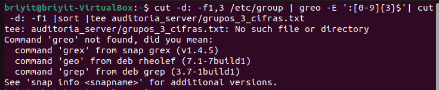
- Escribimi greo y es grep por eso  en la terminal  nos dio la respuesta que se ve en la imagen
- 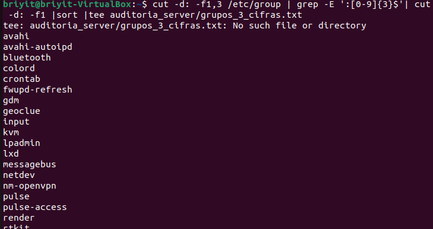
- No tenemos la carpeta creada por esa razon el comando no puede copiar esa informacion en una carpeta inexistente
- 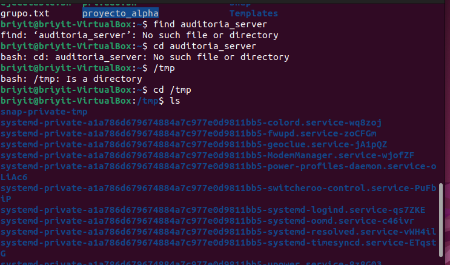
- como esta parte del ejercicio lo realice otro dia , por eso se elimino el directorio y los archivos ya que estaban alojados en /tmp
- procedo hacer los pasos de la fase 1 y 2
- 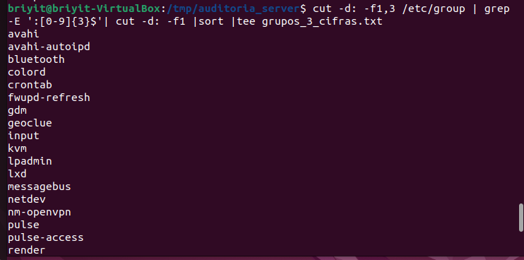
- ahora si se ejecuta el comando 
- 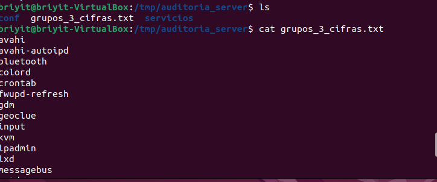
- `ls ` comprobarmos la creación del archivo
-  `cat grupos_3_cifras.txt`
-  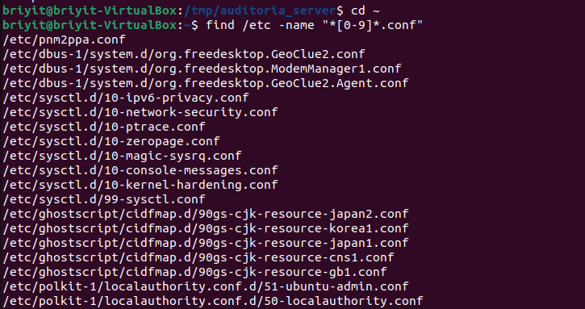
-  `cd ~` volvemos a home
-  `find /etc -name "*[0-9]*.conf"`
-  `ls /carpeta_que_no_existe /home > salida.txt 2> errores.txt`
-  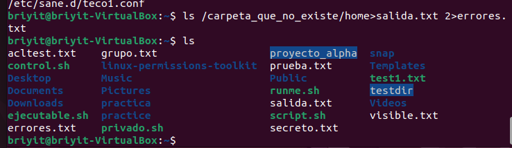
-  `ls ` comprobamos
-  Se han creado las carpetas de forma correcta
-  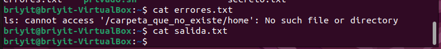
-  `cat errores.txt`
-  notamos que dice que no se tiene acesso , procedemos a comprobar con la otra carpeta
-  `cat salida.txt `
-  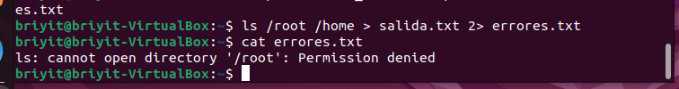
-  `ls /root /home > salida.txt 2> errores.txt` lstamos una ruta para comprobar
-  `cat errores.txt` ver el contenido de la carpeta
-  podemos notar permission denied
-  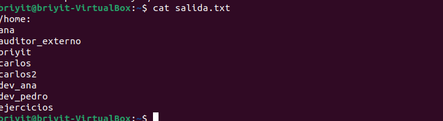
-  `cat salida.txt ` vemos el contenido de la otra carpeta 

## PARTE 4: Procesos y Systemd
1. Control de Procesos: Lanza un comando sleep 1000 & en segundo plano. Luego, usa ps y grep para encontrar su PID, y finalízalo enviándole la señal SIGKILL.
2. Systemctl: Encuentra todos los servicios que fallaron al arrancar (estado failed) usando systemctl y filtra la salida para ver solo el nombre del servicio

- `sleep 1000 &`
- vemos el numero 
- `ps aux | grep sleep`
- 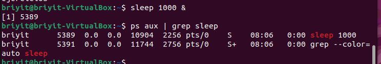
- el numero que vimos es a quien le vamos ejecutar el kil
- `kill -9 1234`
- 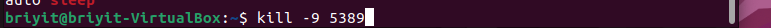
- `ps aux | grep sleep` comprobamos
- 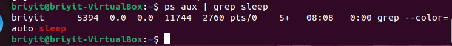
- `systemctl list-units --state=failed`
- 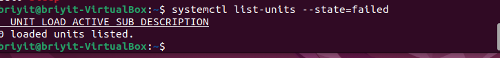
- `systemctl list-units --state=failed | grep ".service"`
- 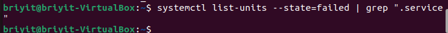


