# El Gran Desafío: Proyecto Alpha
**Contexto**: Eres el SysAdmin y debes preparar el servidor para el nuevo "Proyecto Alpha". 
- Debes crear la estructura, asegurar los permisos, configurar el entorno y verificar el estado del sistema.

--- 
**Fase 1:** Fundamentos, Jerarquía y Rutas
- Exploración: Ve a /usr/local/bin y verifica si hay scripts ahí. Luego, regresa a tu $HOME.
- Estructura FHS: Crea en tu directorio personal una carpeta llamada proyecto_alpha. Dentro, crea la siguiente estructura usando un solo comando:
- proyecto_alpha/data
- proyecto_alpha/scripts
- proyecto_alpha/logs
---
- **PATH**: Crea un script sencillo llamado hola.sh dentro de scripts que imprima "Entorno Alpha listo". Dale permisos de ejecución y agrégalo temporalmente a tu $PATH para que puedas ejecutarlo solo escribiendo hola.sh desde cualquier carpeta.
- **Fase 2**: Usuarios, Grupos y Permisos Especiales
  - Identidad: Crea un grupo llamado desarrolladores.
  - Usuarios: Crea dos usuarios: dev_ana y dev_pedro. Agrégalos al grupo desarrolladores.
  - Propiedad: Cambia el dueño de toda la carpeta proyecto_alpha. El dueño debe ser dev_ana y el grupo desarrolladores.
  - Seguridad (Permisos):
  - Configura proyecto_alpha/data para que el grupo tenga permisos de lectura y escritura, pero "otros" no puedan ver nada.
  - Aplica el Sticky Bit a proyecto_alpha/data para que los desarrolladores puedan crear archivos, pero no borrar los archivos de sus compañeros.
  - Sudo: Asegúrate de que dev_ana pueda usar sudo para ver los logs del sistema.
  
- **Fase 3**: Comandos Esenciales, Filtros y Regex
- Generación de Data: Crea un archivo en data/usuarios_simulados.txt que contenga una lista de 10 nombres inventados.
- Filtrado: Usa grep y una expresión regular para encontrar todos los nombres que comiencen con la letra "A" o "M" en ese archivo y guarda el resultado en data/filtro.txt.
- Análisis de Logs: Copia las últimas 50 líneas de /var/log/syslog (o /var/log/messages) al directorio proyecto_alpha/logs/system_check.log.
- Tuberías: Busca en ese nuevo archivo de log cuántas veces aparece la palabra "error" o "fail" (sin importar mayúsculas) y cuenta las líneas usando wc.

---
**Fase 4:** Procesos y Almacenamiento . p
- Monitoreo: Identifica el proceso que más memoria consume en este momento y guarda su PID en un archivo llamado logs/top_proceso.txt.
- Simulación de Servicio: Usa systemctl para verificar el estado del servicio ssh (o sshd). Si está activo, reinícialo.
- Sistemas de Archivos: Usa el comando df -h y filtra con grep para mostrar solo el uso de tu partición raíz (/).
- Montaje: Identifica qué sistemas de archivos de tipo tmpfs están montados actualmente.

## Solución

## Fase 1

-` cd /usr/local/bin  ` intro en el directorio que vamos analizar
- pruebo `ls -la` y recuerdo que es para ver permisos
- pruebo con solo `ls` lo cual no da como resultado nada
- `ls -f ` Visualizar los archivos y directorios contenidos en un directorio específico.
- `ls *.sh` no se encuentran documentos con terminación .sh

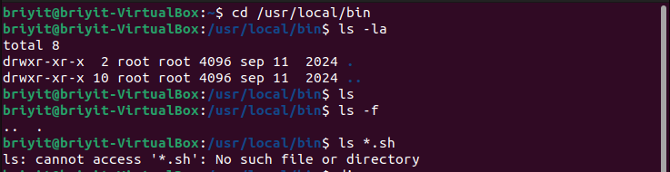

--- 
```text
Comandos básicos para ver archivos:
ls: Lista archivos y directorios en la ubicación actual.
ls -l: Muestra información detallada: permisos, propietario, tamaño y fecha de modificación.
ls -a: Muestra todos los archivos, incluyendo los ocultos (aquellos que empiezan con un punto . ).
ls -lh: Lista los archivos con tamaños legibles (KB, MB, GB).
ls -R: Muestra el contenido del directorio y sus subdirectorios de forma recursiva.
ls -S: Ordena los archivos por tamaño en orden descendente.

```
- `cd ~` vuelvo a home
- 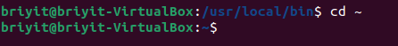

- `mkdir proyecto_alpha` , creamos el directorio principal del proyecto 

- 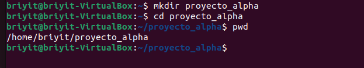

- `mkdir data scripts logs`, creamos los sub directorios del proyecto 
- 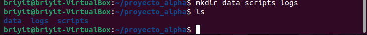

- 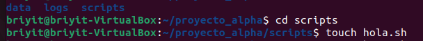

- Dentro de scripts escribimos  `echo "escrito" > hola.sh` para crear en script
- 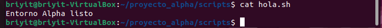

--- 
## Fase 2  Dar permisos de ejecución

- Para que Linux trate al archivo como un programa y no como un simple texto, usa el comando chmod:
- `chmod +x scripts/hola.sh`
- 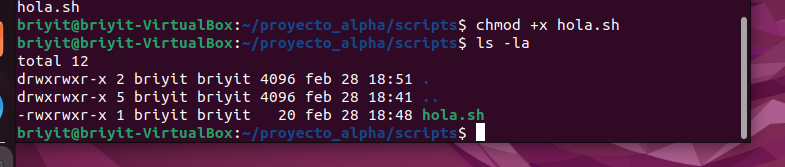
- 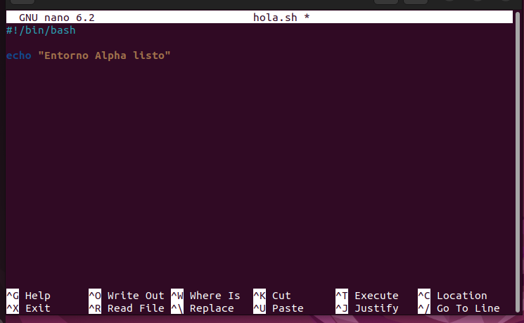
- export PATH="$PATH:$(pwd)"

- 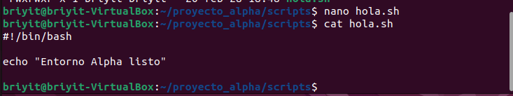
- El Shebang (#!) es una instrucción crítica que le dice al sistema operativo exactamente qué programa debe usar para interpretar el código que viene a continuación


- 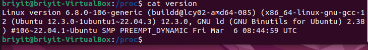

parte 2 


- 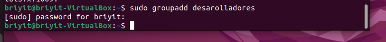

- 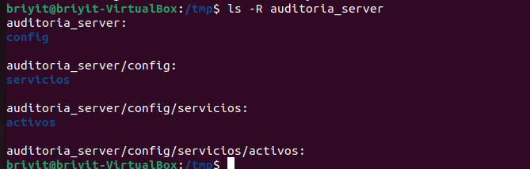
  
- La forma "Pro" (En una sola línea) :Puedes usar el comando gpasswd, que está diseñado específicamente para gestionar los miembros de un grupo:

- `sudo gpasswd -M usuario1,usuario2 desarrolladore` 

- 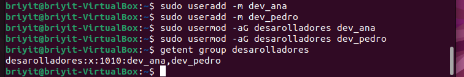
- utiliza el comando chown con la opción recursiva para que afecte a todo el contenido

- `sudo chown -R dev_ana:desarrolladores proyecto_alpha`

- `ls -ld proyecto_alpha`, comporbamos los permisos 

- 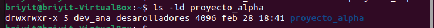
- como cambiamos de dueño tengo que asignar permisos con sudo 

- `sudo chmod 750 data`

- 
- Linux no encuentra la carpeta proyecto_alpha porque la está buscando dentro de sí misma.
- La solución: Usa un punto . (que significa "esta carpeta donde estoy ahora"):
- `sudo chmod +t .` asigmanos persiso en el directorio

- 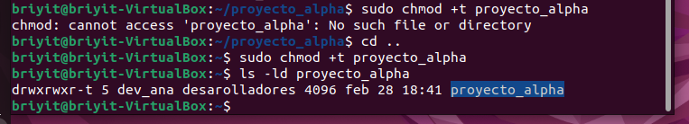

- Grupo sudo
- `usermod -aG sudo dev_ana` Se vuelve administradora. Puede ver logs y borrar el disco si quiere.
- Grupo adm
- `usermod -aG adm dev_ana` Específico para logs. Puede leer archivos de sistema pero no romper nada.


- importante: Después de ejecutar cualquiera de estos comandos, el usuario dev_ana debe cerrar sesión y volver a entrar para que el sistema reconozca que ahora pertenece a ese nuevo grupo.


- 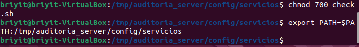

- 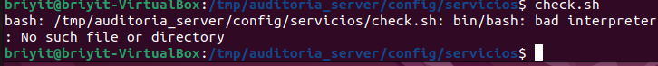

- 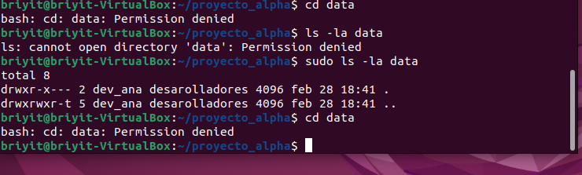
- No soy parte del grupo desarolladores por ello no puedo crear archivos 


- 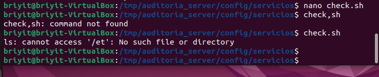
- Tengo que reiniciar para que sea parte del grupo para que el sistema actualice los nuevos permisos y me permita acceder 

- Reinicio estándar: `sudo reboot`
- 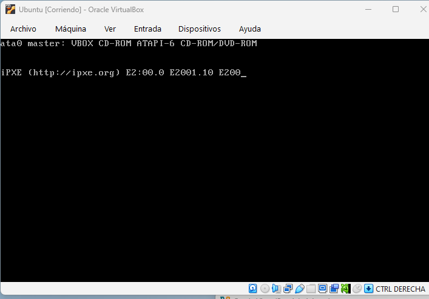
- 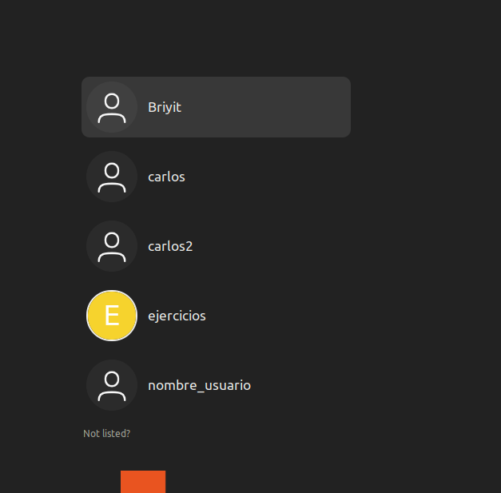
- 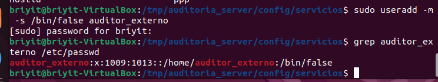
- 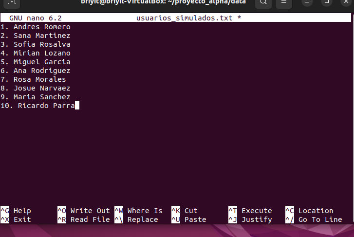
  
- `nano usuarios_simulados.txt ` 

- 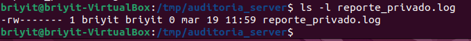
- 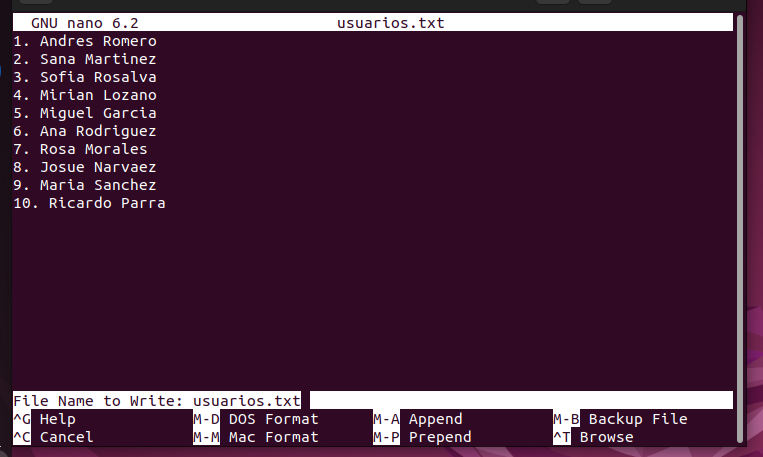

- permisos drwxr-x---. Fíjate en la "x" del final: el grupo solo tiene permiso para entrar (x) y leer (r), pero no tiene permiso de escritura (w).

- 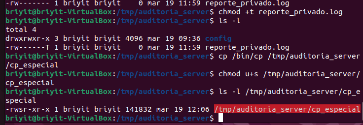

- Presiona Ctrl + X (para salir)

```text
^: Indica que la búsqueda debe empezar justo al inicio de la línea.
[0-9]+\. : Sirve para ignorar el número y el punto que tienes al principio de cada fila (ej: "1. ").
[AM]: Busca la letra A o la M inmediatamente después del espacio.
```

- `grep -E "^[0-9]+\.[[:space:]][AM]" usuarios.txt` hacemos la primera busqueda 

- 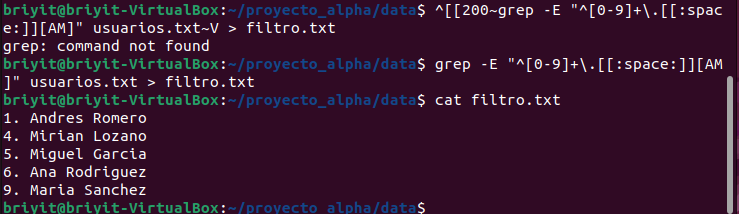

- 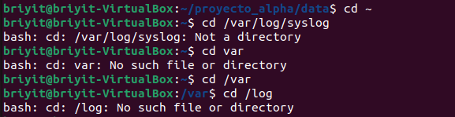
- 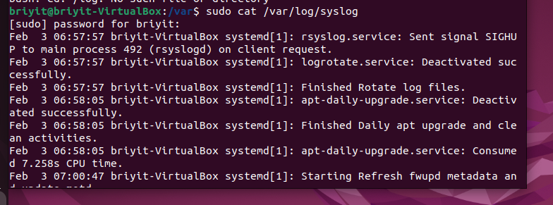

- 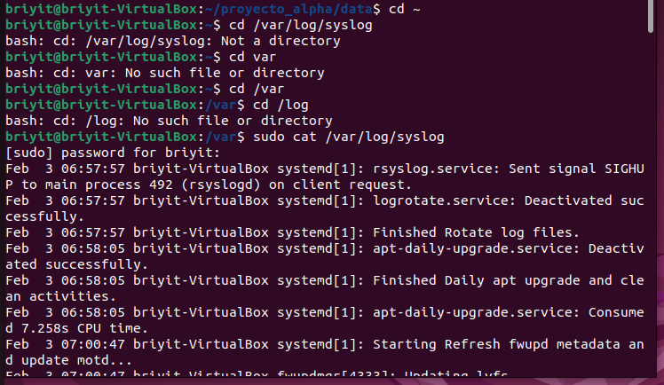


- `sudo tail -n 50 /var/log/syslog > ~/proyecto_alpha/logs/system_check.log` creamos un nuevo archivo que contenga las 50 primeras lineas de syslog 

- 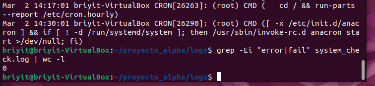

- 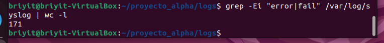


- ¿Qué son esos 171 eventos?
```text
"Iniciando el servicio de red..."
"Cronómetro de limpieza ejecutado con éxito."
"Usuario briyit inició sesión."
```

- qué dicen esos 171 mensajes ( los primeros 10),
- `sudo grep -i "systemd" /var/log/syslog | head -n 10`

- 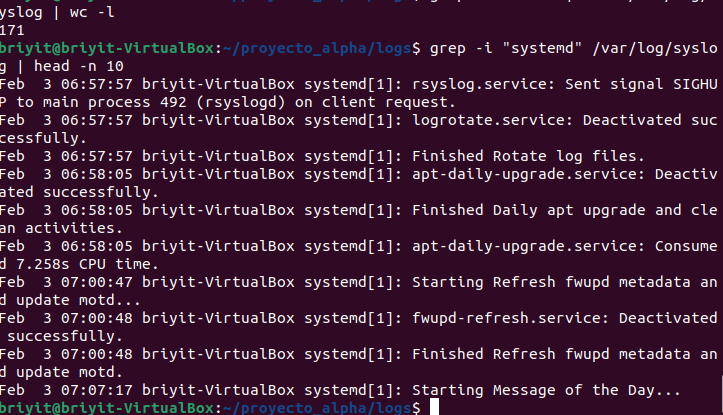

---
## Fase 4

- con el comando `top `
- 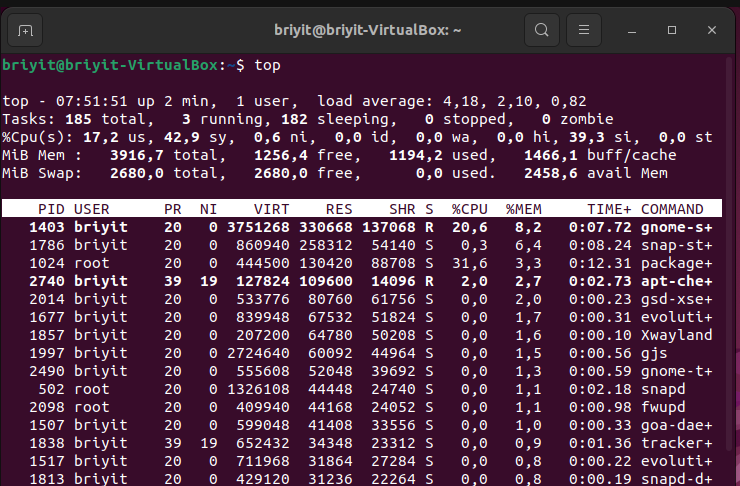
  - Podemos notar que 
  - PID: 1403
  - COMMAND: gnome-shell (aparece como gnome-s+)
  - %MEM: 8,2%
### Tener encuenta
| Columna |	Descripción |
|%MEM |	Porcentaje de RAM física usada por el proceso.|
|RES	|Memoria residente real en RAM. Es el dato más fiable.|
|VIRT	|Memoria virtual total asignada (incluye librerías y archivos).|
|SHR	|Memoria compartida con otros procesos.|

---
El proceso packagekitd (identificado como package+ con PID 1024) presenta una carga de CPU del 31,6% debido a una operación de actualización de repositorios o descarga de paquetes del sistema (Ubuntu).

- shif p 
- 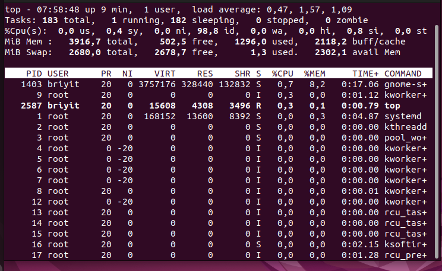
- probe con el comando y me salia que no hay tal  archivo o directorio `ps -eo pid --sort=-%mem | head -n 2 | tail -n 1 > logs/top_proceso.txt`
- `cd ~ `me dirijo a home ls compruebo que si este el proyecto , como di una ruta relativa supongo que esa es una de las razones de que no lo encontrara el sistema
- `cd proyecto_alpha `
- Ingreso nuevamente el comando
- 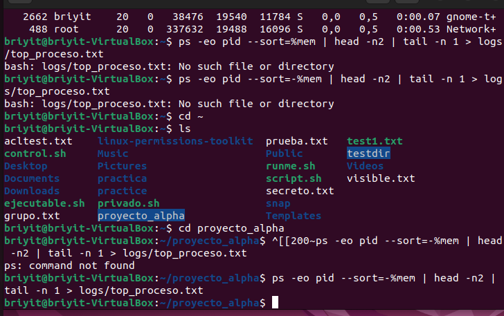
- `cat logs/top_proceso.txt` reviza comprobamos
- 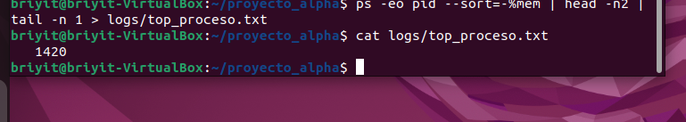
- escribo el comando `systemctl`
- 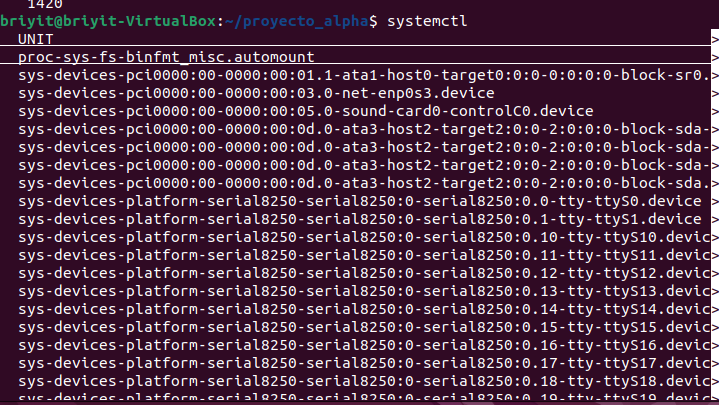
- 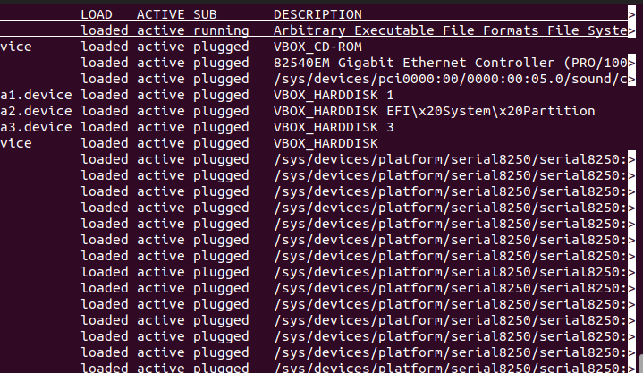
- salgo presionado la tecla q
- `sustemctl status ssh` buscamos especificamento ssh
- 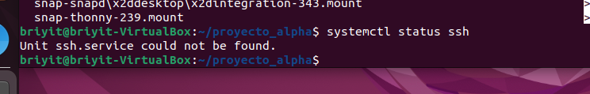

---
Ese error "Unit ssh.service could not be found" significa que el servidor SSH no está instalado en tu máquina virtual. En Ubuntu Desktop, por seguridad, el servidor SSH no viene instalado por defecto.

## Instalacion del paquete ssh
- `sudo apt update && sudo apt install openssh-server -y`
- 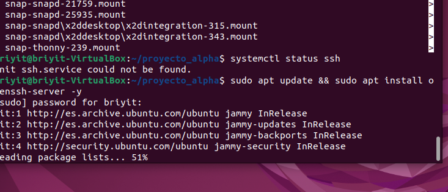
- `systemctl status ssh ` comprobamos si se instalo
- 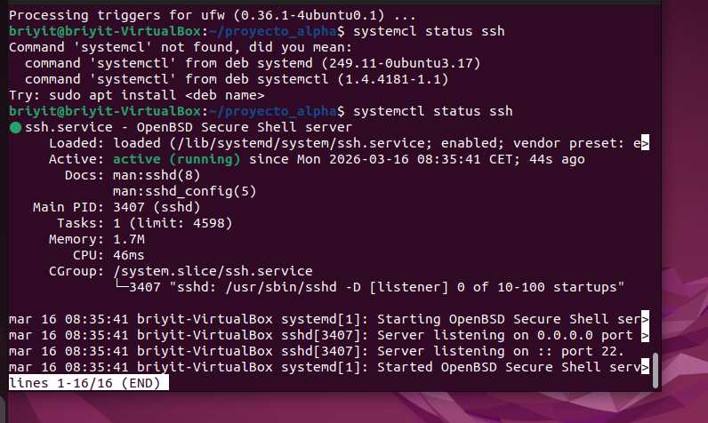
- `sudo sustemctl restart shh` reinicamos ssh
- 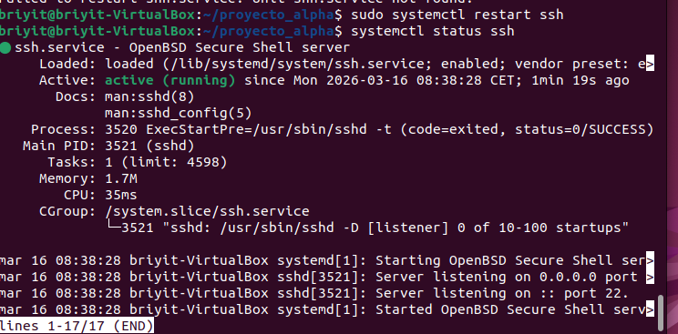
- comprobamos con `systemctl status ssh `
- tecla q para salir

## Que arranque shh al encender la PC
- `sudo systemctl enable ssh`
- 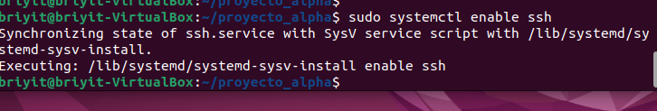
- **Por razones de seguridad es mejor no tenerlo activo**, tener los permisos minimos necesarios 
- `sudo systemctl stop ssh` deja de escuchar conexiones
- **no se abra solo al reiniciar**
- `sudo systemctl disable ssh `desabilitamos 
- `systemctl status ssh` comprobamos
- 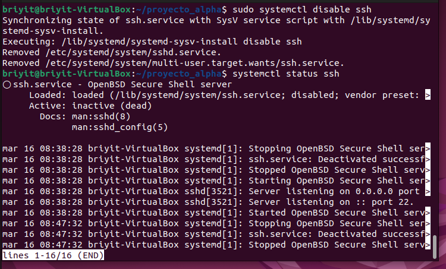
- "Si se requiere activar nuevamentes usar `sudo systemctl start ssh`"

## Script para automatizar el monitoreo de memoria 
- nano monitor_recursos.sh
- 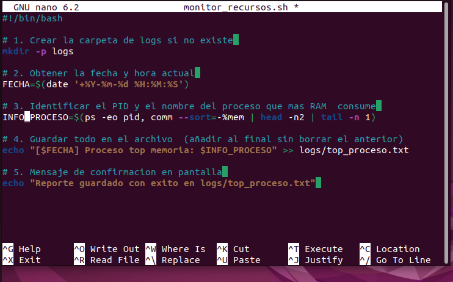
- 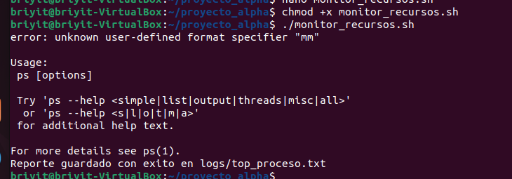
-  
- correción 

```Bash
#!/bin/bash

# 1. Crear la carpeta de logs si no existe
mkdir -p logs

# 2. Obtener la fecha y hora actual
FECHA=$(date '+%Y-%m-%d %H:%M:%S')

# 3. Identificar el PID y el nombre del proceso que más RAM consume
INFO_PROCESO=$(ps -eo pid,comm --sort=-%mem | head -n 2 | tail -n 1)

# 4. Guardar todo en el archivo (añadiendo al final sin borrar lo anterior)
echo "[$FECHA] Proceso top memoria: $INFO_PROCESO" >> logs/top_proceso.txt

# 5. Mensaje de confirmación en pantalla
echo "Reporte guardado con éxito en logs/top_proceso.txt"
```
- Presiona Ctrl + O y luego Enter.
- Presiona Ctrl + X.
- dar permisos para que el script se ejecute
- `chmod +x monitor_recursos.sh`
- ./monitor_recursos.shcomrpbacion
- 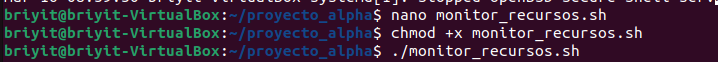
- `cat logs/top_proceso.txt` comprobamos
- 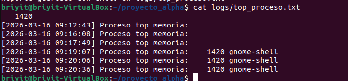

---
- `df -h | grep -w "/"` ver el espacio en la raiz 
- 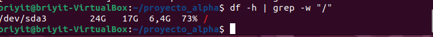
- añadiremos este comando a nuestro script
  
 ```Bash
  # 6. Ver el espacio en la raíz
ESPACIO=$(df -h | grep -w "/" | awk '{print $5}')
echo "[$FECHA] Espacio ocupado en raíz: $ESPACIO" >> logs/top_proceso.txt
```

- 
- comprobamos `cat logs/top_proceso.txt`
- 

- `df -t tmpfs` RAM que se esta ocupando
- 
- `df -t tmpfs --total -h | tail -n 1` cuánta RAM están ocupando todos esos tmpfs juntos

- 


  


