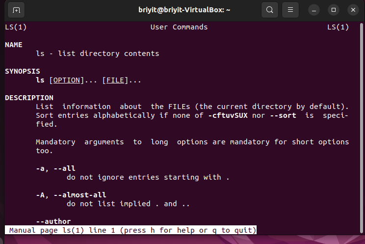
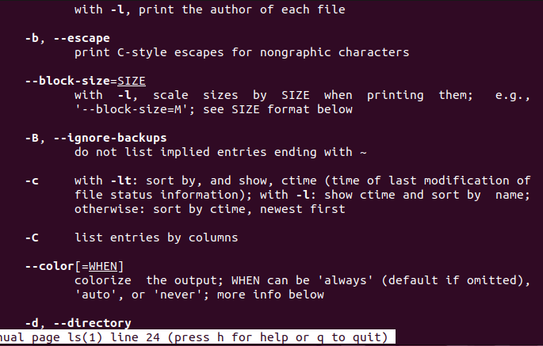
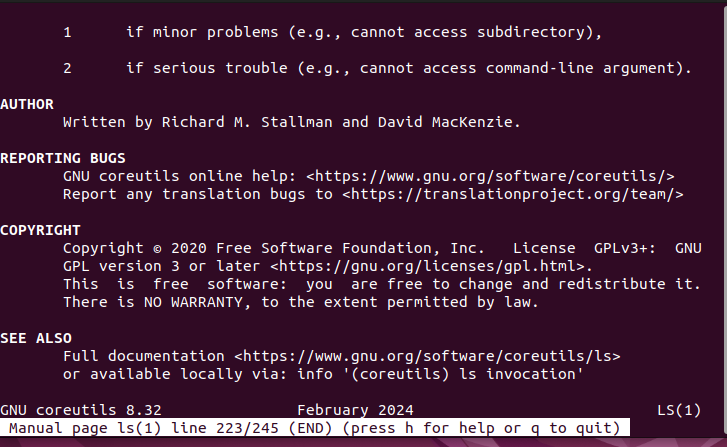

# SINTAXIS DE COMANDOS BÁSICOS
## ¿Cuál es la sintaxis de un comando?
En Linux, todos los comandos siguen una estructura general:

```Text
comando  [opciones]  [argumentos]
```

## Comando
Es la acción que quieres ejecutar.
---
**Ejemplo:**
    - `ls` → listar archivos
    - `cp` → copiar
    - `rm` → eliminar
---
## Opciones (flags)
Modifican el comportamiento del comando.
- Siempre empiezan con - o --.
---
**Ejemplos:**
- `-l` → formato largo
- `-a` → mostrar archivos ocultos
- `--help` → mostrar ayuda
## Argumentos
Son los objetos sobre los que actúa el comando: archivos, carpetas, rutas.
---
**Ejemplos:**
- ls /home
- cp archivo.txt /tmp/
- **2. Ejemplos reales**
- **Ejemplo 1****: listar archivos ocultos en formato largo
- `ls -la`
- `ls` → comando
- `-l` → opción
- `-a` → opción
---
- `-l` → formato largo
- `-a` → mostrar archivos ocultos
- `-r` → recursivo
- `-h` → formato legible (human readable)

---
**Ejemplo 2**: copiar un archivo a otra carpeta
```text
cp documento.txt /home/briyit/
```
- `cp` → comando
- documento.txt → argumento
- /home/briyit/ → argumento
---

**Ejemplo 3**: eliminar una carpeta con todo su contenido
```text
rm -r carpeta/
```
- rm → comando
- -r → opción
- carpeta/ → argumento

## leer la ayuda de un comando
Esto es fundamental para Linux.
- --help
Muestra una explicación rápida: `ls --help`
- man
Abre el manual completo: `man ls`

- Opciones largas → empiezan con dos guiones --
- Son palabras completas.
```text
Ejemplos:
--help
--version
--all
--recursive
```
## --help
--help sirve para mostrar una explicación rápida del comando:
- qué hace
- qué opciones tiene
- cómo se usa
```text
cp --help
```
- Te muestra:
- cómo copiar archivos
- cómo copiar carpetas
- qué opciones existen
-**ejemplos**
  Es como un “manual rápido”.
  
## man
man significa manual. Sirve para abrir el manual completo de un comando.
```text
man ls
```
Te muestra:
- descripción completa
- todas las opciones
- ejemplos
- detalles técnicos
- Para salir del manual: `q`

- Dentro del manual:
- `q` → salir
- /palabra → buscar
- `n `→ siguiente coincidencia

Concepto Tu respuesta Corrección
-l muestra todo muestra formato largo
--help ayuda del comando ayuda rápida del comando
-a archivos ocultos correcto
Argumento donde se ejecuta objeto sobre el que actúa el comando
Manual de cp cp man man cp


Elemento Qué es
Comando La acción
Flag Modifica la acción
Argumento El objeto sobre el que actúa
man Manual completo
--help Ayuda rápida


### Cómo leer la sintaxis de un comando en los manuales (man), que es la parte que te va a permitir entender cualquier comando nuevo que encuentres en Linux.

- Cuando abres un manual con:
```text
man ls
```




## SYNOPSIS
Ahí aparece la “forma general” del comando,
- Corchetes [ ] → Opcional
```text
ls [opciones]
```
Significa que puedes usar opciones, pero no son obligatorias.




- `ls` tiene más de 50 flags



- [ ] → opcional
- { } → elegir una opción
- ... → se puede repetir
- MAYÚSCULAS → variable que tú reemplazas


