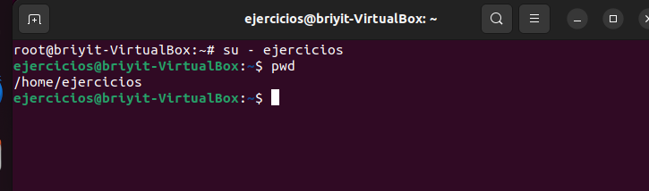
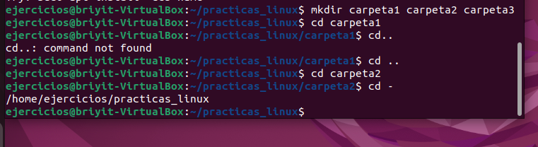
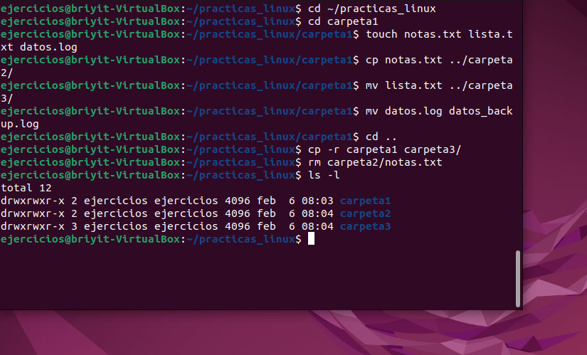
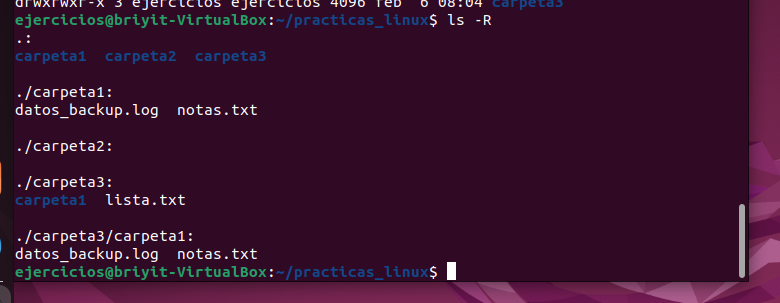

# Tema 5 Comandos esenciales

Lo vamos a dividir así:
- Comandos de navegación
- Comandos de archivos y directorios
- Comandos de lectura de archivos
- Comandos de búsqueda
- Redirecciones y pipes

Haremos ejercicios practicos 

## 1. Comandos de navegación

-`pwd:`Muestra dónde estás.
- `cd:`Moverse entre directorios.
**Ejemplos:**

`cd /etc →`carpeta de configuración
`cd ..→`sube un nivel
`cd ~ →` te lleva al home del usuario
`cd - →` regresa al directorio anterior

-` ls`:Listar archivos.
**Opciones importantes:**
`ls -l →` formato largo
`ls -a → `incluye ocultos
`ls -lh →` tamaños legibles
`ls -R →` recursivo

"La h significa human readable (legible para humanos)."
Entonces verás:
Código
4.0K
20K
100K
1.2M
2.3G
Mucho más claro.
Sirve para entender rápidamente cuánto ocupa cada archivo.

ls -R
Recursivo
Ver todas las subcarpetas y su contenido

**EJERCICIO PRÁCTICO 1**— Navegación
Haz esto en tu terminal:
1. Ve a tu carpeta personal:
`cd ~`

2. Crea una carpeta llamada practica_linux

`mkdir practica_linux`

3.Entra en ella

`cd practica_linux`

4.Crea tres carpetas dentro:

`mkdir carpeta1 carpeta2 carpeta3`


5.Muévete entre ellas usando:

`cd carpeta1`
`cd ..`
`cd carpeta2`
`cd -`

**Solución**

- Accedemos a nuestra maquina virtual 
- con `ctrl + alt + t`Accedemos a la terminal
- Cambiamos al usuario ejercicios ya que tenemos destinado para este tipo de practicas. 
- Comprobamos que estamos en el directorio correspondiente



**Navegación**
1. Escribimos en la terminal :
`cd ~`
2. Creamos la carpeta de practica_linux
`mkdir practica_linux`
3. Acceso a ella 
`cd practica_linux`
Creo las 3 carpetas 
`mkdir carpeta1 carpeta2 carpeta3`
4. Me muevo entre ellas 
`cd carpeta1`
`cd ..`
`cd carpeta2`
`cd -`




# TEMA 5 — Parte 2: Comandos de archivos y directorios


`cp →` copiar
`mv →` mover o renombrar
`rm → `borrar
`mkdir →` crear directorios
`touch →` crear archivos vacíos


- 1. `touch `— crear archivos vacíos
Sirve para crear archivos rápidamente:

```text
touch archivo1.txt
touch notas.log
```

También actualiza la fecha de modificación si el archivo ya existe.

- 2. `cp` — copiar archivos o carpetas
Copiar un archivo:

`cp archivo1.txt archivo2.txt`

Copiar a otra carpeta:

`cp archivo1.txt carpeta2/`

Copiar carpetas completas (requiere -r):

`cp -r carpeta1 carpeta3/`

- 3.` mv `— mover o renombrar
Mover un archivo:

`mv archivo1.txt carpeta2/`

Renombrar un archivo:

`mv archivo1.txt archivo_renombrado.txt`
Mover carpetas:

`mv carpeta1 carpeta3/`

- 4.` rm `— borrar archivos o carpetas
Borrar un archivo:

`rm archivo1.txt`

Borrar una carpeta completa:

`rm -r carpeta1`

Borrar sin pedir confirmación:

`rm -rf carpeta1`

**EJERCICIO PRÁCTICO 2 —** Usando tus carpetas creadas.
Vamos a trabajar dentro de tu carpeta practicas_linux.
1. Entra en la carpeta:
`cd ~/practicas_linux`

2. Dentro de carpeta1, crea tres archivos:
`cd carpeta1`
`touch notas.txt lista.txt datos.log`

3. Copia notas.txt a carpeta2:
`cp notas.txt ../carpeta2/`

4. Mueve lista.txt a carpeta3:
`mv lista.txt ../carpeta3/`

5. Renombra datos.log a datos_backup.log:
`mv datos.log datos_backup.log`

6. Vuelve a la carpeta principal:
`cd ..`

7. Copia toda carpeta1 dentro de carpeta3:
`cp -r carpeta1 carpeta3/`

8. Borra el archivo notas.txt dentro de carpeta2:
`rm carpeta2/notas.txt`




9. Comprobamosls -R



