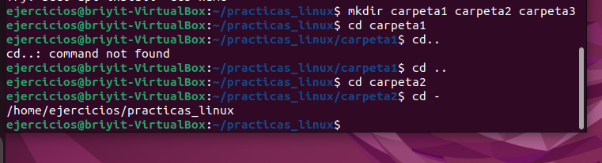
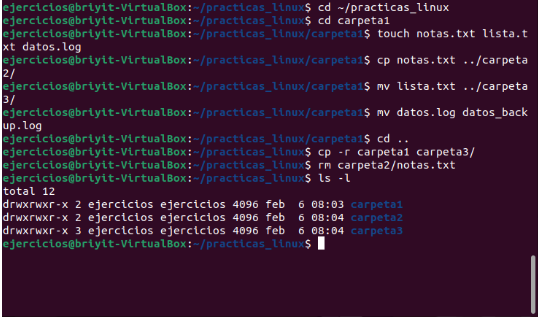

# Tema 5 Comandos esenciales

Lo vamos a dividir así:
1. Comandos de navegación
2. Comandos de archivos y directorios
3. Comandos de lectura de archivos
4. Comandos de búsqueda
5. Redirecciones y pipes
   5.1 Comandos de filtrado y ordenación
6. Ejercicios prácticos

## 1. Comandos de navegación

- `pwd` :Muestra dónde estás.
- `cd`  :Moverse entre directorios.

**Ejemplos:**

- `cd /etc`  Accedes directamente a la carpeta etc
- `cd ..  `  Vas hacia arriba
- `cd ~ `    Te llev a tu carpeta personal 
- `cd - `    Te devuelve / te lleva atras de la carpeta en donde estas

- `ls`  :Listar archivos.

**Ejemplos:**

- `ls -l `  Formato largo
- `ls -a`   Incluye ocultos
- `ls -lh`  Tamaños legibles
- `ls -R`   recursivo

### EJERCICIO PRÁCTICO 1 — Navegación

1. Ve a tu carpeta personal: `cd ~`
2. Crea una carpeta llamada practica_linux: `mkdir practica_linux`
3. Entra en ella : `cd practica_linux`
4.  Crea tres carpetas dentro: `mkdir carpeta1 carpeta2 carpeta3`
5. Muévete entre ellas usando:
  - `cd carpeta1`
  - `cd ..`
  - `cd carpeta2`
  - `cd -`

  

## 2. Comandos de archivos y directorios

 ### `cp ` —  copiar archivos o carpetas.
**Ejemplo:**
- `cp archivo1.txt archivo2.txt`

Copiar a otra carpeta:
- `cp archivo1.txt carpeta2/`

Copiar carpetas completas (requiere -r):
- `cp -r carpeta1 carpeta3/`
/ ponerlo al final son buenas practicas ya que.
Si la carpeta existe: Todo sale bien.
Si la carpeta no existe: El sistema te dará un error

### `mv` — mover o renombrar

-`mv archivo1.txt carpeta2/`

Renombrar un archivo:
-`mv archivo1.txt archivo_renombrado.txt`

Mover carpetas:
- mv carpeta1 carpeta3/

### `rm `— borrar archivos o carpetas
-`rm archivo1.txt`

Borrar una carpeta completa:
-`rm -r carpeta1`

Borrar sin pedir confirmación:
-`rm -rf carpeta1`


## crear archivos o carpetas 

1. `touch`  crear archivos vacíos
Sirve para crear archivos rápidamente:

- `touch archivo1.txt`
- `touch notas.log`
También actualiza la fecha de modificación si el archivo ya existe.


### EJERCICIO PRÁCTICO 2 — Usando tus carpetas creadas
Vamos a trabajar dentro de tu carpeta practicas_linux.
1. Entra en la carpeta:
`cd ~/practicas_linux`

2. Dentro de carpeta1, crea tres archivos:
- `cd carpeta1`
- `touch notas.txt lista.txt datos.log`

3. Copia notas.txt a carpeta2:
`cp notas.txt ../carpeta2/`

4. Mueve lista.txt a carpeta3:
`mv lista.txt ../carpeta3/`

5. Renombra datos.log a datos_backup.log:
`mv datos.log datos_backup.log`

6. Vuelve a la carpeta principal:
`cd ~`

7. Copia toda carpeta1 dentro de carpeta3:
`cp -r carpeta1 carpeta3/`



8. Borra el archivo notas.txt dentro de carpeta2:
`rm carpeta2/notas.txt`
- comprobacion:`ls -R`

La `R` significa recursivo, así que verás algo como:


Ejercicio 2 de comandos : creacion de carpetas, archivos, uso de los comandos vistos
y documentacion de incidencias.

```text

/Proyecto
    |______/docs
    |         |___ lista.txt
    |         |___ maual.txt
    |
    |_____/logs
    |        |__ datos_backup.log
    |_____/src
            |__ main.sh

```
[Ejercicio 2 Comandos de archivo y directorio](Ejercicio_2_comandos_de_archivos_y_directorio.md)


## 3 Comandos de lectura de archivos

- `cat` muestra todo el contenido del archivo en la terminal, de arriba a abajo.
Tener presente que este se usa para archivos muy cortos, si se quiere leer rapido, 
no necesitas navegar o buscar dentro.
    **NO** usar `cat`
    - Cuando el archivo es muy grande
    - Cuando quieres leerlo por partes
    - Cuando quieres navegar dentro del archivo
    - Cuando quieres ver solo el principio o el final
    
    - cat nombre_del_archivo

- `head` comando para ver el principio de un archivo 
Este comando te muestra solo las primeras líneas del archivo.
Por defecto, muestra las primeras 10 líneas.

    - `head nombre_del_archivo`
    - Usar cuando el archivo es largo
    - Solo quieres ver cómo empieza
    - Quieres comprobar si el archivo tiene el formato correcto
    - Quieres revisar la cabecera de un log
    - No quieres que la terminal se llene de texto

- `tail` comando usado para ver el final , te muestra las ultimas 10 lineas del archivo.
    - `tail nombre_del_archivo`
    Cuándo usar tail:
    - Úsalo cuando:
    - Quieres ver lo más reciente
    - Estás revisando logs
    - Estás depurando errores
    - Quieres comprobar si un archivo se actualizó
    - No necesitas ver todo el archivo

- `less` Este comando es como un “visor” dentro de la terminal, te permite verlo entero.

    -`less nombre_del_archivo`
    **Cómo moverte dentro de less**
    - Espacio → baja una página
    - b → sube una página
    - ↑ / ↓ → subir o bajar línea por línea
    - q → salir
    - / + palabra → buscar dentro del archivo

- `tail -f` te muestra las últimas líneas , lectura en tiempo real..
    -`tail -f nombre_del_archivo`
    Úsalo cuando:
      - Estás depurando un error
      - Quieres ver si un servicio está funcionando
      - Quieres ver si un archivo se actualiza
      - Estás monitoreando un proceso
      - Quieres ver logs en tiempo real
      Cómo salir
      Para salir del modo en vivo:
        -Presiona Ctrl + C

  ### Ejercicio comando de lectura de archivos

## 4 Comandos de búsqueda

- `grep` Busca una palabra o frase dentro de un archivo y muestra solo las líneas que coinciden.
`grep "PALABRA" archivo`

  - Esto es extremadamente útil para:
  - Encontrar fallos
  - Buscar usuarios
  - Buscar configuraciones
  - Filtrar logs
  - Analizar archivos grandes

1. Búsqueda sin distinguir mayúsculas/minúsculas
`grep -i "error" archivo`
Esto encuentra:ERROR, Error, error, eRrOr.
2. Mostrar números de línea
`grep -n "ERROR" archivo`
Te dice en qué línea aparece cada coincidencia.
3. Buscar en varios archivos a la vez
`grep "ERROR" *.log`
Busca en todos los archivos que terminen en .log.
4. Buscar dentro de carpetas completas (recursivo)
`grep -r "ERROR" /ruta/carpeta`
Busca en todos los archivos dentro de esa carpeta y subcarpetas.
5. Contar cuántas coincidencias hay
`grep -c "ERROR" archivo`
Te dice cuántas veces aparece la palabra.
6. Muestra todo menos las líneas con “ERROR”.
`grep -v "ERROR" sistema.log`

|Opción |Significado|
|:--|:--|
|-i |Ignorar mayúsculas/minúsculas|
|-n |Mostrar número de línea|
|-c |Contar coincidencias|
|-r |Búsqueda recursiva en carpetas|
|-v |Mostrar todo excepto lo que se busca|

## 5. Redirecciones y pipes

**Redirecciones**
- `> `sobrescribe un archivo con la salida de un comando.

- `>> `añade contenido al final sin borrar lo anterior.

- `< `usa un archivo como entrada para un comando.

**Pipes (|)**
Conectan comandos: la salida del primero pasa a ser la entrada del siguiente.

**Ejemplos típicos:**
- Filtrar: cat archivo | grep "texto"
- Contar resultados: grep "ERROR" log | wc -l
- Ordenar: grep "OK" log | sort
- Quitar duplicados: sort archivo | uniq

### 5.1 Comandos de filtrado y ordenación

1. `wc` :Cuenta líneas, palabras o caracteres.
`wc archivo`
- `wc -l` : olo líneas
- `wc -w `:solo palabras
- `wc -c` :solo caracteres
Muy útil con pipes: `grep "ERROR" log | wc -l`

2.`sort`:Ordena líneas.
orden alfabético

- `sort -n` orden numérico
- `sort -f` ignora mayúsculas
- `sort -k` 2 ordena por columna 2
Combinado con pipes: `cat usuarios | sort`

3. `uniq`:Elimina duplicados consecutivos.
limpia duplicados seguidos

- `uniq -d` muestra solo los duplicados
- `uniq -c` muestra cuántas veces aparece cada línea
Normalmente se usa con sort:`sort archivo | uniq`


    


