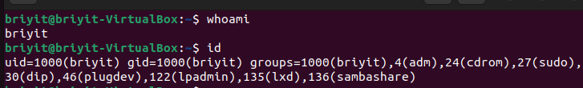
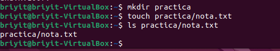

# Objetivo de la clase 

integrar informacion sobre usuarios , grupos, permisos y navegacion por el sistema
Un **usuario**: en linux es una identidad con un UID que posee permisos que tiene un directorio y se puede mover en el y tomar accion segun los permisos que tenga.
Un **grupo**: es un conjunto de usuarios que comparte un archivo carpeta tienen un GID tambien permisos.

---

## 1. Ver tu usuario y tus grupos

whoami  : Indica el nombre del usuario
id  : indica el UID , GID grupo principal, en los grupos que estoy permiso tengo

---

```bas
whoami
id
```




| **Grupo**     | **Función principal** |
| :---  |  :---  | 
|adm | Ver logs del sistema (administración)|
|cdrom | Acceder a CD/DVD|
|sudo | Ejecutar comandos como root|
|dip | Usar conexiones de red (Dial‑up IP)|
|plugdev | Usar dispositivos USB y externos|
|lpadmin | Administrar impresoras|
|lxd | Usar contenedores LXD|
|sambashare | Compartir archivos por red (Samba)|

---

## 2. Ver usuarios y grupos del sistema

```bas
getent passwd
getent group
```

-getent passwd: Muestra la lista de usuarios registrados. Aunque incluye la ruta de su "home" (carpeta personal), no te muestra qué hay dentro de ella.


-getent group: Muestra la lista de grupos y qué usuarios pertenecen a cada uno.


**Podemos ver**:
-ver todos los usuarios del sistema
-comprobar si un usuario existe
-ver su UID, GID, home y shell
-usarlo en scripts o auditorías

Linux no solo tiene los grupos de los usuarios humanos, sino también:
grupos del sistema
grupos usados por servicios
grupos usados por demonios (daemons)
grupos usados por hardware
grupos usados por redes
grupos usados por seguridad


adm:x:4:syslog,briyit
Significa:
adm → nombre del grupo
x → contraseña del grupo (no se usa, está en shadow)
4 → GID del grupo
syslog,briyit → usuarios que pertenecen a ese grupo


**En el desarollo de nuestro plan de aprendizaje mas adelante se desarrolla este punto a mas profundidad y claridad.**


## 3. Crear un directorio y un archivo

mkdir practica  : creamos un directorio llamado practica 

```bash
touch practica/nota.txt
```

creamos  en practica una documento con nombre nota.txt

ls practica/nota.txt verificamos si se creo correctamente



---
## 4. Ver permisos

```bash
ls -l practica
```

Nos muestra que tienen permisos de read y write el usuario el grupo y otros solo read.


## 5. Cambiar permisos básicos

```bash
chmod 644 practica/nota.txt  
```


con los permisos que fueron asignados en 644 al usuario se le quito x lo que implica que no tiene acceso de ejecución.


---

## 5.1 
Procedemos a cambiar la asignacion de permisos por chmod 755 practica

```bash
chmod 755 practica/nota.txt  
```

## 6. Confirmar cambios

```bash
ls -l practica
```


. 


