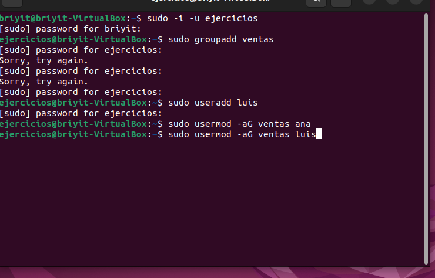
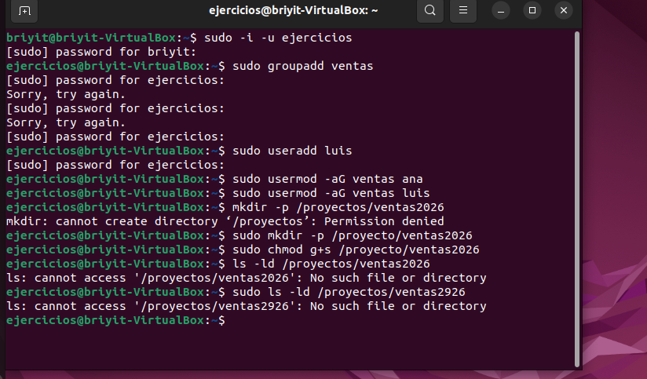
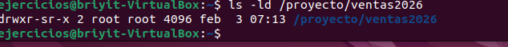
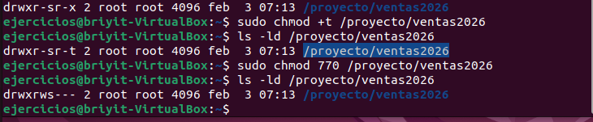
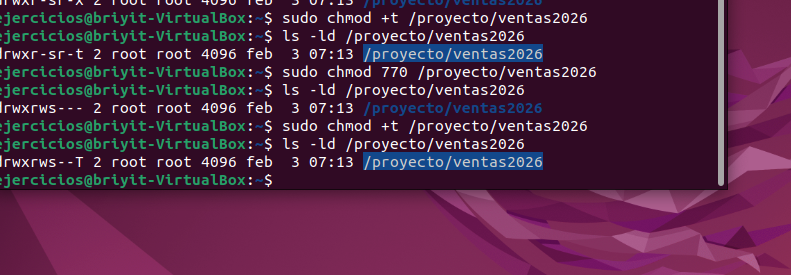
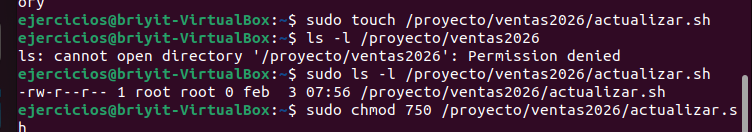
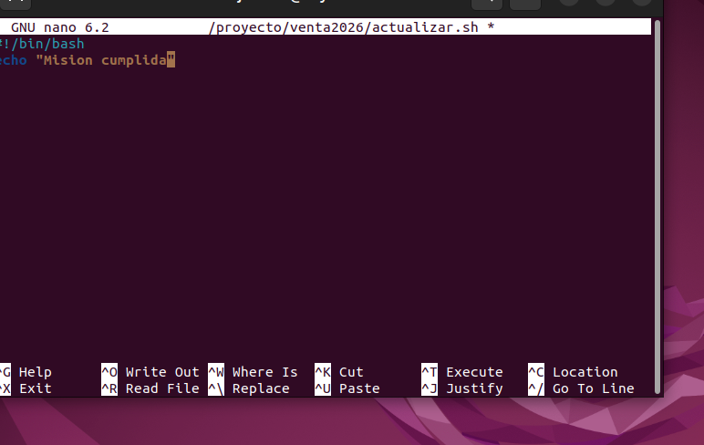
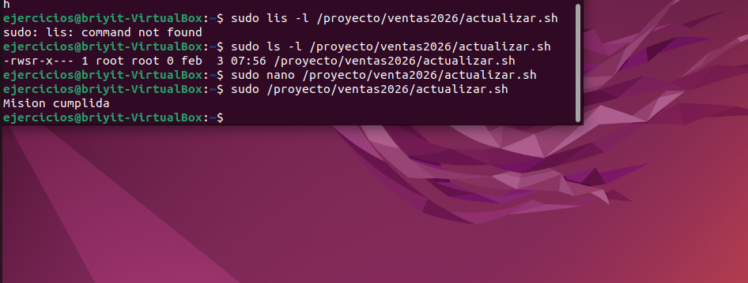

# Administración básica de usuarios y permisos
Ejercicio práctico de Linux — Gestión de usuarios, grupos y permisos

## Objetivo del ejercicio
Demostrar dominio de:
-Creación de usuarios
-Creación de grupos
-Gestión de permisos
-Navegación en el sistema
-Comandos administrativos
- Resolución de errores reales

## Preparación del entorno
Abrimos la terminal:

---
1. Accedemos a la terminal con:
`Ctrl + Alt + T`
2. Verificamos el usuario actual:
`pwd`
3,Cambiamos al usuario destinado para ejercicios:
`su - ejercicios`
4.Verificamos que el cambio fue exitoso:
`pwd`

## Creación del grupo devteam

Creamos el grupo solicitado:

5.`sudo groupadd devteam`
nos pide asignar una clave 

### Creación del usuario ana
Creamos el usuario:
El usuario ana ya esta creado en un ejercicio anterior, por eso creamos el usuario luis
6. `sudo useradd -m luis
7. Agregamos los usuarios al grupo con 
`sudo usermod -aG ventas nombre_del_usuario

8. Creamos la carpeta proyectos con una subcarpeta ventas2026:
`mkdir -p /proyectos/ventas2026`
lo que nos genera un Permission deny 

`sudo mkdir -p /proyectos/ventas2026`
debemos recordar usar sudo.

## Asignacion de permisos
asignamos el permiso  SGID (Set Group ID): se usa en directorios compartidos, todos los archivos nuevos creados dentro heredan el grupo del directorio, no el grupo principal del usuario creador.

9.`sudo chmod g+s /Proyectos/ventas2026`

procedemos a listar , se cometieron direfentes errores como añadir una s en proyectos, se considero que quizas necesitaria el comando sudo 

10. Listamos con el comando 
`ls -ld /proyectos/ventas2026`
l : lista larga.
d: Lista los directorios por su nombre, no su contenido.

en la imagen apreciamos que se asigno el permiso correctamente `sr`

10.**Sticky Bit** permiso que se aplica a directorios para restringir la eliminacion de archivos.

`sudo chmod +t /proyecto/ventas2026`

analizamos los permisos otorgadors y notamos que otros tenia permisos de lectura

- procedemos hacer un cambio con:
`sudo chmod 770 /proyecto/ventas2026`

volvemos a combrobar con: `ls -ld /proyectos/ventas2026`

como podemos notar en la imagen los permisos fuero cambiados correctamente mas el **Sticky Bit** desaparecio.

" Importante primero analizar los permisos del archivo para hay si aplicar los permisso especiales. "

asignamos nuevamente el permiso :
`sudo chmod +t /proyecto/ventas2026`
comprobamos:
`ls -ld /proyectos/ventas2026`

## Creacion de carpeta

creamos un archivo: `sudo touch /proyecto/ventas2026/actualizar.sh`
Comprobamos con :`sudo ls -ld /proyecto/ventas2026/actualizar.sh`

### permisos del archivo
En este archivo vamos asignar permisos para que el usuario  ejecutar, leer, escribir pero los otros no y los del grupo puedan tener los permisso justos.

`sudo chmod 750  /proyecto/ventas2026/actualizar.sh`

comprobamos 
`sudo ls -ld /proyecto/ventas2026/actualizar.sh`

## Escribir en el archivo creado 

`sudo nano /proyecto/ventas2026/actualizar.sh`

- llamamos al interprete con: `#!/bin/bash`
- con `echo ` escribimos en el: `echo "Mision cumplida"`

Una vez que salgas de Nano (Ctrl+O, Enter, Ctrl+X)

- con `sudo /proyecto/ventas2026/actualizar.sh`, lo ejecutamos 

