# Análisis del rendimiento y arranque de mi máquina virtual (Ubuntu en VirtualBox)
Durante esta sesión analicé por qué mi máquina virtual con Ubuntu estaba arrancando más lento de lo normal. No había instalado paquetes nuevos ni modificado configuraciones, pero el sistema mostraba retrasos evidentes en el arranque y en la carga de la sesión. A continuación documento el proceso de análisis, las herramientas utilizadas y las conclusiones.

## 1. Síntomas iniciales
### 1.1 Pantalla negra prolongada
En el arranque, la pantalla se quedaba en negro entre 40 segundos y 1 minuto.
-  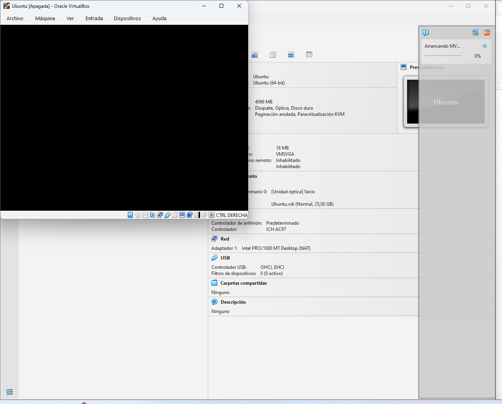

### 1.2 Procesos visibles antes del login
Aparecía una pantalla mostrando procesos del sistema durante unos 30 segundos antes de cambiar a la interfaz gráfica.

-  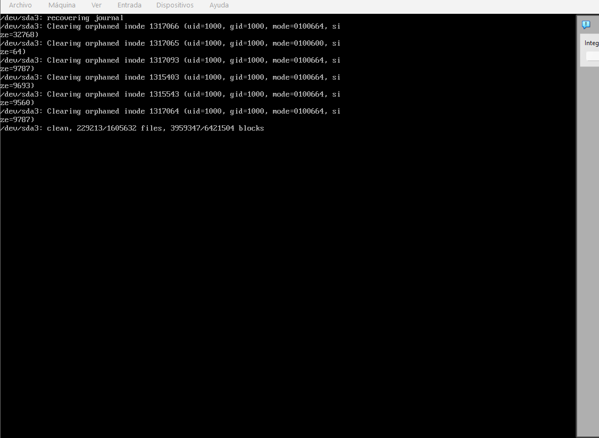

Esto ocurre porque Ubuntu estaba reparando el disco debido a apagados incorrectos.

## 2. Causa principal detectada
El problema no era un virus ni un paquete malicioso.
La causa era apagados incorrectos de la máquina virtual.

Cuando no apago Ubuntu desde su menú interno, el sistema detecta un apagado brusco y debe:
  - Revisar el disco
  - Reparar sectores
  - Reconstruir el journal
  - Esto añade entre 10 y 20 segundos extra en cada arranque.

## 3. Análisis con herramientas del sistema
Abrí la terminal con Ctrl + Alt + T.

### 3.1 systemd-analyze
```bash
systemd-analyze
```
-  
Resultado:
  - Startup: 6.13s
  - Userspace: 32.032s
  - El mayor consumo de tiempo estaba en userspace.

### 3.2 systemd-analyze blame
```bash
systemd-analyze blame
```
-  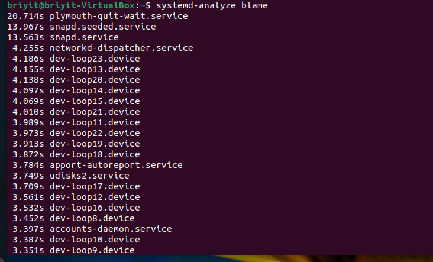

Servicios destacados:
- plymouth-quit-wait.service (20.7s)
- No es la causa real: solo espera a otros servicios.
- snapd.seeded.service + snapd.service (~27s)
- Snap es pesado en máquinas virtuales.

### 3.3 systemd-analyze critical-chain
```bash
systemd-analyze critical-chain
```
-  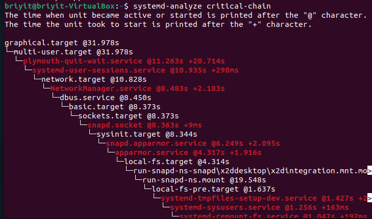

Aquí se ve que:
  - NetworkManager-wait-online está retrasando el arranque.
  - Si no necesito que la red esté lista antes del login:

```bash
sudo systemctl disable NetworkManager-wait-online.service
```
## 4. Análisis de rendimiento con htop
Instalé htop:

```bash
sudo apt install htop
```
-  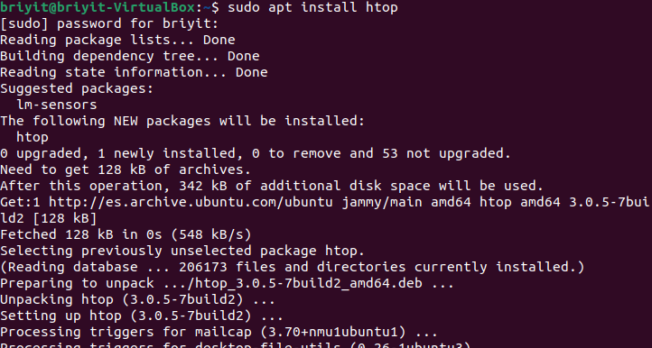
-  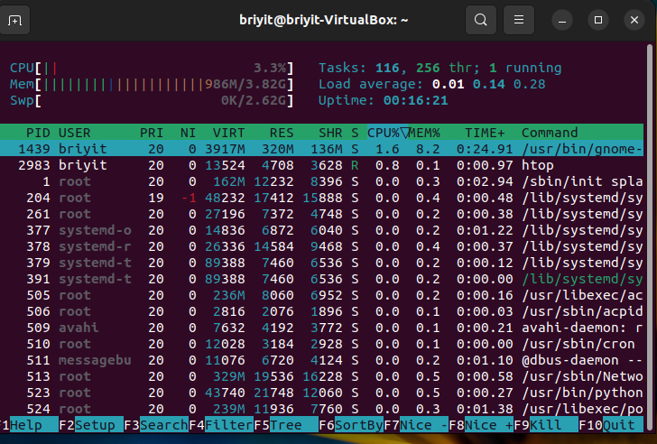

Observaciones:
  - La VM tenía solo 1 CPU asignado.
  - Esto explica parte de la lentitud.

## 5. Análisis del disco con iostat
Instalé sysstat:

```bash
sudo apt install sysstat
```
-  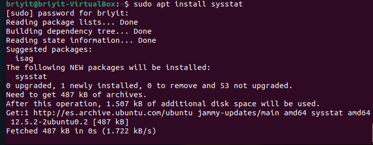
-  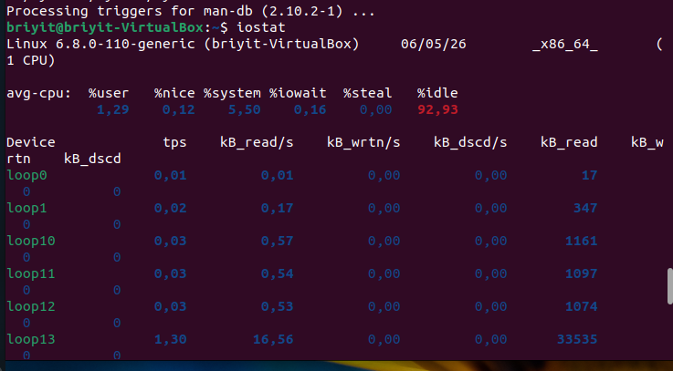
CPU idle 92.93%  


Esto indica que el problema no era CPU, sino esperas de disco.

## 6. Ajustes en VirtualBox
-  

Apagué correctamente la VM:

-  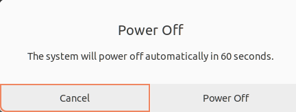

Luego ajusté:

### 6.1 Procesador
De 1 CPU → 2 CPUs

### 6.2 Vídeo
128 MB de memoria de vídeo

Aceleración 3D activada
-  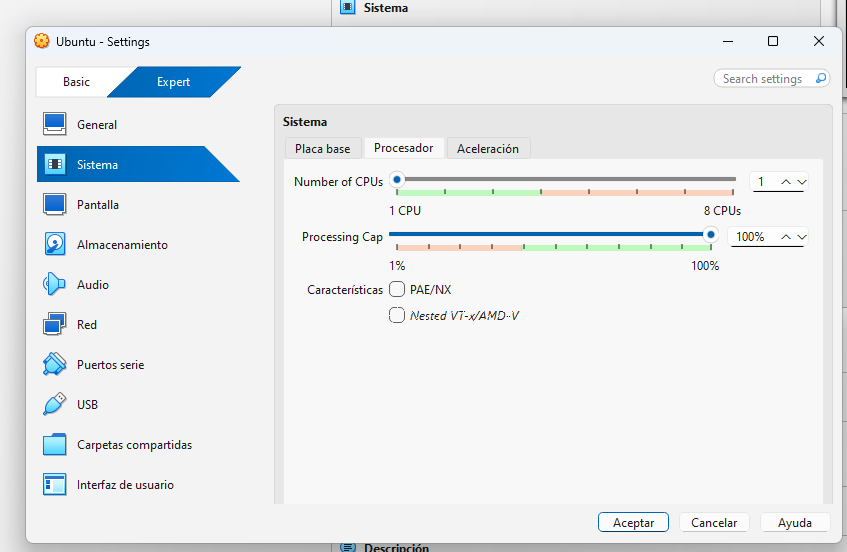
-  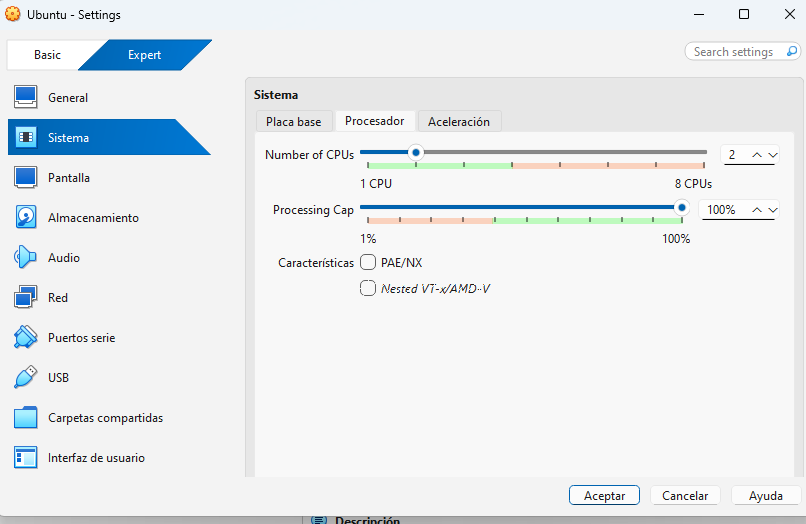
-  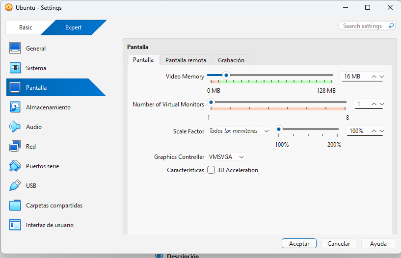
-  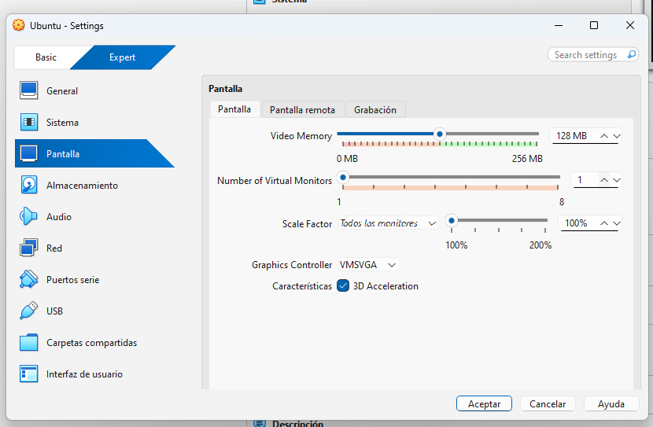


## 7. Nuevo arranque después de optimizar
-  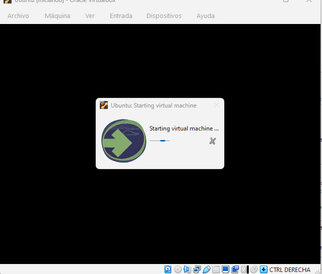

El arranque tardó un poco porque estaba aplicando actualizaciones.
-  
-  
-  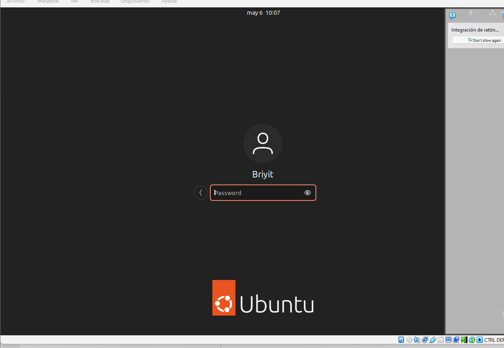


Esto confirma que el disco ya no necesita reparaciones.

## 8. Limpieza de paquetes Snap
```bash
sudo du -h /var/lib/snapd/snaps
```
-  


## 9. Nuevo análisis del arranque
-  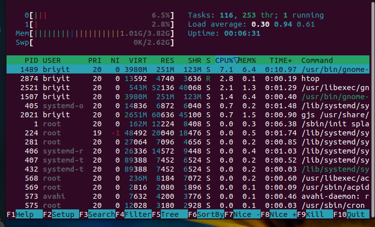

 — systemd-analyze blame actualizado  
-  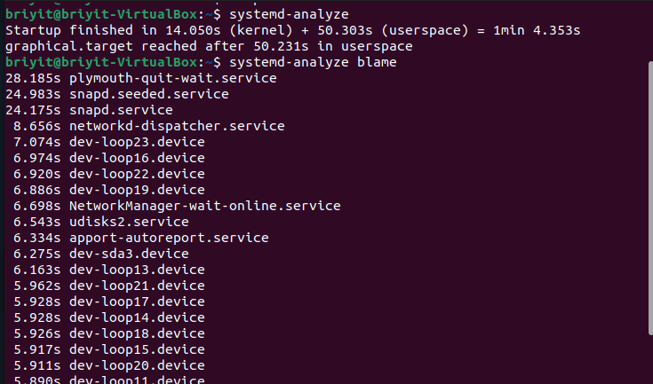

Razones del comportamiento:
  - Con 2 núcleos, Ubuntu intenta paralelizar procesos
  - Si el disco físico no es SSD, se produce cuello de botella
  - Snap sigue siendo lento
  - NetworkManager-wait-online sigue retrasando el arranque si no se desactiva

## 10. Desactivar NetworkManager-wait-online
Este servicio obliga a Ubuntu a esperar hasta que la red esté completamente lista.
En máquinas virtuales suele retrasar el arranque.

```bash
sudo systemctl disable NetworkManager-wait-online.service
```
-  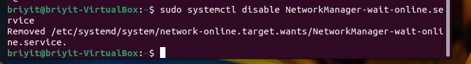

## 11. Conclusiones
Durante este análisis aprendí:
  - La importancia de apagar correctamente la VM
  - Cómo diagnosticar tiempos de arranque con systemd
  - Cómo identificar servicios lentos
  - Cómo interpretar htop e iostat
  - Cómo mejorar el rendimiento asignando más CPUs
  - Cómo desactivar servicios que retrasan el arranque


Después de los ajustes, la máquina virtual funciona mejor y el arranque es más estable.
